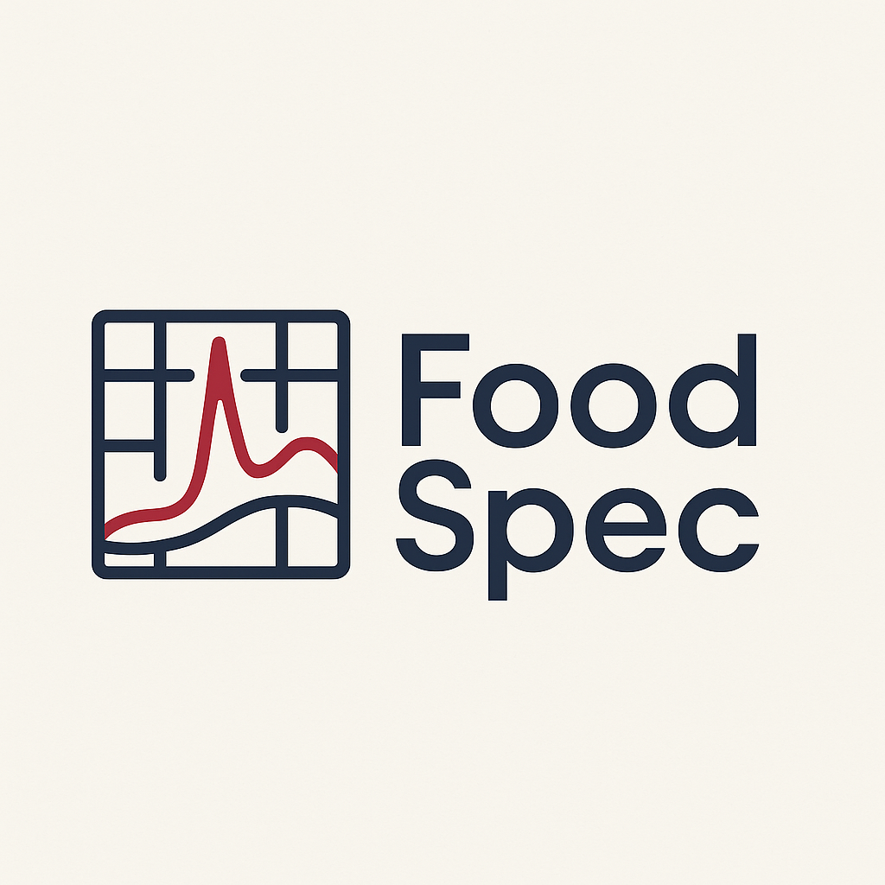

# foodspec



> **Headless, research-grade Python toolkit for Raman and FTIR spectroscopy in food science.**  
> Built around clear data models, reproducible preprocessing, feature extraction, chemometrics, and domain workflows.

---

## Why foodspec?

Modern food science uses Raman and FTIR spectra everywhere: oil authentication, adulteration detection, heating/oxidation studies, quality control, and even hyperspectral imaging.  
But most analyses are locked in ad hoc scripts, inconsistent preprocessing, and irreproducible notebooks.

**foodspec** aims to fix that.

- A **unified data model** for spectra and hyperspectral cubes.  
- **Pipeline-style preprocessing** (baseline, smoothing, scatter correction, normalization, FTIR/Raman helpers).  
- **Chemometrics + ML workflows** for classification, regression, mixture analysis, and QC.  
- **Domain templates** for edible oils, heating degradation, and more.  
- **CLI + config + logging + reporting** for reproducible runs.  
- Aligns naturally with a **MethodsX-style protocol** and FAIR principles.

---

## Key Features

### Core Data Structures

- `FoodSpectrumSet`  
  - Batches of 1D spectra (`x: (n_samples, n_wavenumbers)`),  
  - Shared `wavenumbers`,  
  - `metadata` as a `pandas.DataFrame` (oil type, mixture fraction, etc.),  
  - `modality` tag (`"raman"` / `"ftir"` / others).
- `HyperSpectralCube`  
  - 3D cubes: `(height, width, n_wavenumbers)`,  
  - Conversions to/from `FoodSpectrumSet` with pixel-wise metadata,  
  - Helpers for ratio maps and clustering visualizations.

### IO & Reproducibility

- HDF5 library helpers: `create_library`, `load_library` for large spectral libraries.  
- Example and public dataset loaders:
  - `load_example_oils()` – synthetic, self-contained example dataset.  
  - `load_public_mendeley_oils(...)` – hook for a public edible-oil dataset.  
  - `load_public_evoo_sunflower_raman(...)` – EVOO–sunflower mixture dataset.  
  - `load_public_ftir_oils(...)` – FTIR edible-oil dataset hook.  
- Tidy CSV/HDF5 exporters, metadata round-tripping, and validation utilities.

### Preprocessing (sklearn-style, pipeline-friendly)

- Baseline:
  - ALS (Eilers), rubberband, polynomial baseline.  
- Smoothing:
  - Savitzky–Golay, moving average.  
- Normalization / scatter correction:
  - Vector (L1/L2/max), area, internal-peak normalization.  
  - **SNVNormalizer** (Standard Normal Variate).  
  - **MSCNormalizer** (Multiplicative Scatter Correction).  
- Derivatives:
  - Savitzky–Golay derivatives (1st/2nd).  
- Cropping:
  - `RangeCropper` and FTIR-specific helpers.  
- Raman/FTIR specifics:
  - `CosmicRayRemover`, `AtmosphericCorrector`, `SimpleATRCorrector`.

### Feature Extraction

- Peaks:
  - `PeakFeatureExtractor` (heights, areas with tolerance windows).  
- Bands:
  - `integrate_bands` for integrated regions.  
- Ratios:
  - `RatioFeatureGenerator` / `compute_ratios` for chemically meaningful ratios (e.g. 1652/1742, 3010/2850).  
- Fingerprinting:
  - Cosine/correlation similarity helpers.

### Chemometrics & Machine Learning

- PCA:
  - `run_pca` giving scores, loadings, explained variance.  
- Models:
  - Classifier/regressor factory: Random Forest, SVM variants, Logistic Regression, PLS / PLS-DA, kNN, etc.  
- Validation:
  - Cross-validation helpers, classification/regression metrics, permutation tests.  
- Mixture analysis:
  - `nnls_mixture` (non-negative least squares).  
  - `mcr_als` for mixture decomposition.  
- Optional deep learning:
  - `Conv1DSpectrumClassifier` (1D CNN) with sklearn-like API.  
  - Guarded imports: raises a clear error if TensorFlow is not installed.

### Applications (Turnkey Workflows)

- **Oil authentication**  
  `run_oil_authentication_workflow`  
  → preprocess → peaks/ratios → classifier → metrics, confusion matrix, feature importances.
- **Heating degradation**  
  `run_heating_degradation_analysis`  
  → ratios vs time → trend models → ANOVA (optional).  
- **Quality control / novelty detection**  
  `train_qc_model`, `apply_qc_model`  
  → one-class SVM / IsolationForest on reference spectra.  
- **Domain templates**  
  - Dairy, meat, microbial workflows that re-use the oil-style template.

### Visualization

- Spectra:
  - Overlays, mean spectra, before/after preprocessing plots.  
- PCA:
  - Score and loading plots.  
- Classification:
  - Confusion matrices.  
- Heating:
  - Ratio/time trends with grouped comparisons.  
- Hyperspectral:
  - Ratio maps and cluster maps from `HyperSpectralCube`.

### Validation, Logging, Reporting

- `validation` module:
  - `validate_spectrum_set`, `validate_public_evoo_sunflower` (shape, monotonic axes, NaNs, mixture ranges).  
- Logging:
  - Lightweight logger + run metadata (versions, platform, timestamp).  
- Reporting:
  - Standardized run directories with:
    - `metrics.json`  
    - `run_metadata.json`  
    - plots (PNG)  
    - `report.md`  
- Config:
  - YAML/JSON configs for CLI runs via `--config`.

---

## Installation

Requires Python 3.10+.

```bash
# core installation
pip install foodspec

# with "deep" extras (1D CNN requires TensorFlow)
pip install 'foodspec[deep]'
```

Note: TensorFlow is not installed by default. Calling `Conv1DSpectrumClassifier` without it will raise a clear ImportError suggesting `pip install 'foodspec[deep]'`.

---

## Quickstart (Python API)

```python
from pathlib import Path

from foodspec.core.dataset import FoodSpectrumSet
from foodspec.preprocess.baseline import ALSBaseline
from foodspec.preprocess.smoothing import SavitzkyGolaySmoother
from foodspec.preprocess.normalization import VectorNormalizer
from foodspec.features.ratios import RatioFeatureGenerator
from foodspec.chemometrics.models import make_classifier
from foodspec.validation import validate_spectrum_set

# 1. Load spectra (example or public loader)
fs = FoodSpectrumSet(
    x=...,  # shape (n_samples, n_wavenumbers)
    wavenumbers=...,
    metadata=...,
    modality="raman",
)
validate_spectrum_set(fs)

# 2. Build a preprocessing pipeline (illustrative only)
# (In practice, use sklearn.pipeline.Pipeline)
als = ALSBaseline(lambda_=1e5, p=0.001)
savgol = SavitzkyGolaySmoother(window_length=11, polyorder=3)
norm = VectorNormalizer(norm="l2")
X_proc = norm.transform(savgol.transform(als.transform(fs.x)))

# 3. Extract peak ratios (example)
ratio_gen = RatioFeatureGenerator(
    ratio_def={"ratio_1652_1742": ("peak_1652_height", "peak_1742_height")}
)
ratio_table = ratio_gen.transform(...)

# 4. Prepare X, y and train a classifier
fs.metadata["oil_type"] = ...  # ensure target column exists
train_set, test_set = fs.train_test_split(target_col="oil_type", test_size=0.3)
X_train, y_train = train_set.to_X_y("oil_type")
X_test, y_test = test_set.to_X_y("oil_type")

clf = make_classifier("rf", random_state=42)
clf.fit(X_train, y_train)
print("Test accuracy:", clf.score(X_test, y_test))
```

---

## CLI Usage

After installation, you get a `foodspec` command with multiple subcommands.

### Check installation

```bash
foodspec about
```

This prints:
- foodspec version
- Python version
- optional extras status (deep learning)
- documentation URL

### Oil authentication workflow

Using a config file:

```bash
foodspec oil-auth --config examples/configs/oil_auth_public.yml
```

Loads your spectral library and/or public datasets.  
Runs preprocessing → features → classifier → validation.  
Creates a timestamped run directory with metrics, plots, and a Markdown report.

### Protocol benchmarks (public datasets)

```bash
foodspec protocol-benchmarks --output-dir runs/protocol_benchmarks
```

Uses public dataset loaders (if available).  
Runs a classification benchmark and a mixture analysis.  
Saves metrics + run metadata + a summary report.

### MethodsX protocol reproduction

```bash
foodspec reproduce-methodsx --output-dir runs/methodsx_protocol
```

Reproduces the core analyses described in the MethodsX protocol article (classification + mixture analysis + PCA).  
Uses public datasets (or synthetic stand-ins where documented).  
Produces a complete run directory with metrics, run metadata, plots, and a Markdown report.

For full details and all commands (heating, QC, domains, hyperspectral, mixture, model registry), see the documentation.

---

## Public Datasets

The package includes loaders for several public edible-oil datasets, but it does not bundle the data.

Typical workflow:

Follow instructions in the docs (`docs/libraries.md`) to:
- Download the Mendeley edible-oil dataset (Raman/FTIR).
- Download the EVOO–sunflower mixture dataset.
- Download an FTIR edible-oil dataset.

Place them in the documented folder structure. Then:

```python
from foodspec.data import load_public_mendeley_oils, load_public_evoo_sunflower_raman

fs_mend = load_public_mendeley_oils(root="path/to/mendeley")
fs_mix = load_public_evoo_sunflower_raman(root="path/to/evoo_sunflower")
```

Each loader:
- Returns a validated `FoodSpectrumSet`.
- Adds metadata such as oil_type, mixture_fraction_evoo, dataset_name, doi, etc.

---

## Documentation

Full documentation (Getting started, API, CLI, workflows, MethodsX protocol, deep learning, citing) is provided via MkDocs.

Docs URL:  
https://chandrasekarnarayana.github.io/foodspec/

### Documentation as a book

The site is organized like a book (Foundations → Preprocessing → ML → Workflows → Protocols → API). Use the sidebar to navigate parts/chapters, or jump via the keyword index. Quickstarts and appendices are available if you prefer a task-first approach.

Key pages:
- Getting started – installation, basic examples, data loading.
- Libraries – building and loading spectral libraries (HDF5, CSV, public datasets).
- Validation & Chemometrics – PCA, ML, oil-authentication examples.
- MethodsX protocol – mapping between foodspec workflows and the MethodsX protocol article.
- Advanced: Deep Learning – optional 1D CNN model usage.
- Citing foodspec – how to cite the package and the protocol paper.

---

## Citing foodspec

If you use foodspec in your research, please cite:

- The software (this package), via the `CITATION.cff` file included in the repository.
- The MethodsX protocol article (once published), which formally describes the workflow.

Until the article is out, you can use a provisional citation:

Chandrasekar Subramani Narayan, *foodspec*: A Python toolkit for Raman and FTIR spectroscopy in food science, software version 0.2.0, 2025.

See `CITATION.cff` for machine-readable citation metadata.

---

## Contributing

Contributions (bug reports, feature requests, docs improvements) are welcome.  
Please open an issue on GitHub to discuss major changes.

When sending PRs:
- Run `pytest` (all tests should pass).
- Keep coverage ≥ 80% where possible.
- Update docs and type hints for new public APIs.

---

## Acknowledgements

The development of **foodspec** draws upon the collective strength of interdisciplinary research at the intersection of food science, spectroscopy, physics, and machine learning. Its evolution has been enriched by the generous guidance, scientific exchange, and collaborative spirit of several individuals.

### Collaborators & Scientific Contributors

- **Dr. Jhinuk Gupta**  
  *Department of Food and Nutritional Sciences, Sri Sathya Sai Institute of Higher Learning (SSSIHL), Andhra Pradesh, India*  
  LinkedIn: https://www.linkedin.com/in/dr-jhinuk-gupta-a7070141/  
  

- **Dr. Sai Muthukumar V**  
  *Department of Physics, SSSIHL, Andhra Pradesh, India*  
  LinkedIn: https://www.linkedin.com/in/sai-muthukumar-v-ab78941b/  
  

- **Ms. Amrita Shaw**  
  *Department of Food and Nutritional Sciences, SSSIHL, Andhra Pradesh, India*  
  LinkedIn: https://www.linkedin.com/in/amrita-shaw-246491213/  
  

- **Deepak L. N. Kallepalli**  
  *Cognievolve AI Inc., Canada & HCL Technologies Ltd., Bangalore, India*  
  LinkedIn: https://www.linkedin.com/in/deepak-kallepalli/  
  

## Project Intention & Philosophy
foodspec exists to standardize and contextualize computational methods in food spectroscopy. It fills the gap of fragmented tools and inconsistent preprocessing by providing an integrated workflow and learning resource. It serves food scientists, data scientists entering spectroscopy, physicists working with instruments, ML engineers building predictive models for food data, and students learning computational food science. Core principles: open, clear, reproducible workflows; strong scientific grounding across physics, chemistry, statistics, and ML; real-world usability in labs and QA/QC; interpretability and transparency for beginners and experts alike.

---

## License

foodspec is released under the MIT License.  
See the `LICENSE` file for full details.
