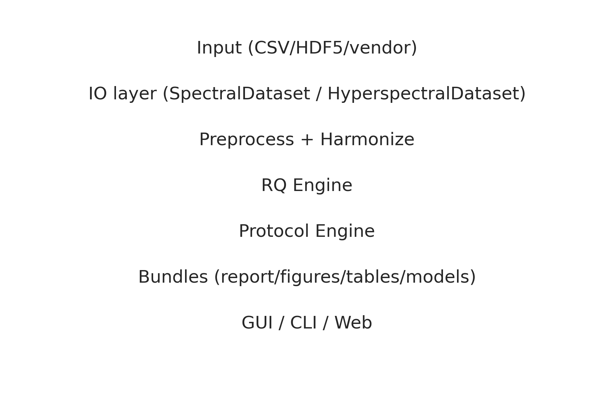

# Advanced Topic – Architecture

This page summarizes the FoodSpec architecture and how data flows through the system.

## High-level flow
```
Input (CSV/HDF5/vendor) 
  → IO layer (SpectralDataset / HyperspectralDataset) 
  → Preprocessing & harmonization 
  → RQ engine (features, stability, discrimination, trends, divergence, minimal panel, clustering) 
  → Protocol engine (steps, validation, orchestration) 
  → Output bundles (report, tables, figures, metadata, models, index.json) 
  → Surfaces (GUI, CLI, Web API)
```



## Key layers
- **IO layer**: `SpectralDataset` for 1D spectra; `HyperspectralDataset` for cubes. NeXus-like HDF5 layout with instrument/sample metadata and preprocessing history. Vendor loaders and plugins extend IO.
- **Preprocessing & harmonization**: baseline, smoothing, normalization, peak extraction; wavenumber alignment, calibration curves, power normalization. Configured via `PreprocessingConfig` or protocol steps.
- **RQ engine**: stability (CV/MAD), discriminative tests (ANOVA/Kruskal+FDR), importance, trends, oil-vs-chips divergence, minimal panel, clustering, guardrails, validation metrics.
- **Protocol engine**: interprets YAML/JSON protocols (steps: preprocess, harmonize, qc, hsi_segment, hsi_roi_to_1d, rq_analysis, output). Handles validation, multi-input runs, cancellation hooks, and registry/bundle logging.
- **Output bundles**: run folder with `report.txt/html`, `figures/`, `tables/`, `metadata.json`, `index.json`, `run.log`, `models/` (frozen pipelines).
- **Surfaces**: CLI commands, GUI cockpit/wizard (PyQt, worker threads for long runs), and FastAPI web service (prediction/diagnostics). Plugins extend protocols/loaders via entry points.

## Threading / services
- GUI uses background threads (QThread/QRunnable) for protocol execution with cancel/progress updates.
- Web API (FastAPI) exposes `/models`, `/predict`, `/upload`, `/diagnostics` endpoints; can be containerized and deployed behind LIMS/instruments.

## Extensibility
- Plugins (`foodspect.plugins` entry points) can add protocols, vendor loaders, harmonization strategies, and custom steps.
- Registry logs runs/models for provenance; output bundle `index.json` cross-references models and artifacts.

See also: [protocols_and_yaml.md](../04-user-guide/protocols_and_yaml.md), [validation_strategies.md](validation_strategies.md), [hsi_and_harmonization.md](hsi_and_harmonization.md), and [web_api_and_services.md](web_api_and_services.md).

## Extensibility
- Plugins (`foodspect.plugins` entry points) can add protocols, vendor loaders, harmonization strategies, and custom steps.
- Registry logs runs/models for provenance; output bundle `index.json` cross-references models and artifacts.
