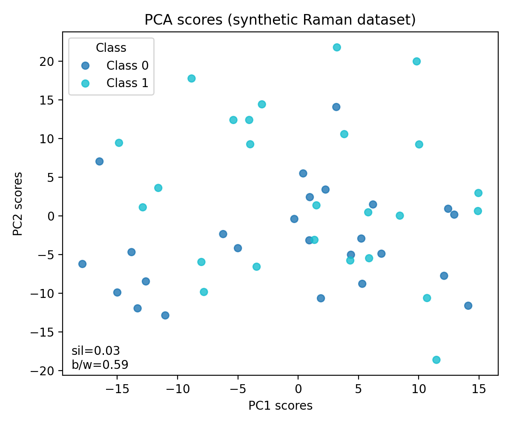

# Documentation Maintainer Guide

**Audience:** Maintainers and core contributors who review and merge documentation PRs.

**Purpose:** Ensure consistent documentation quality and workflow.

---

## Quick Reference

| Task | Command |
|------|---------|
| **Validate all docs** | `python scripts/validate_docs.py` |
| **Check links only** | `python scripts/check_docs_links.py` |
| **Full validation (slow)** | `python scripts/validate_docs.py --full` |
| **Build docs locally** | `mkdocs serve` (preview at http://localhost:8000) |
| **Build for deployment** | `mkdocs build` |
| **Lint markdown** | `markdownlint docs/**/*.md` (if installed) |

---

## 1. Pre-Merge Checklist for Documentation PRs

### Automated Checks (REQUIRED)

Before merging any PR that modifies documentation:

```bash
# 1. Run full validation suite
python scripts/validate_docs.py

# Expected output: "🎉 ALL CHECKS PASSED"
```

If checks fail:
- Review the error messages
- Request changes from the contributor
- Or fix the issues yourself if minor

---

### Manual Review (RECOMMENDED)

1. **Test code examples:**
   ```bash
   # Copy-paste code from the new/modified page
   # Run in a clean environment
   python
   >>> # Paste code here
   ```

2. **Check rendering:**
   ```bash
   mkdocs serve
   # Open http://localhost:8000
   # Navigate to the new/modified page
   # Verify: images load, tables render, code highlights
   ```

3. **Mobile rendering:**
   - Resize browser to mobile width (375px)
   - Check: tables don't overflow, images scale, navigation works

4. **Cross-references:**
   - Click all internal links from the new page
   - Verify they point to the correct sections

---

## 2. Validation Tools

### 2.1 validate_docs.py (Comprehensive)

**What it does:**
- Runs markdownlint (if installed)
- Checks for broken links and images
- Validates MkDocs build
- Custom style checks (code block language tags, heading periods)

**Usage:**
```bash
# Standard validation (fast, ~10 seconds)
python scripts/validate_docs.py

# Full validation with anchor checking (slower, ~30 seconds)
python scripts/validate_docs.py --full

# Skip MkDocs build (for quick link checks)
python scripts/validate_docs.py --skip-build
```

**Exit codes:**
- `0` = All checks passed
- `1` = Some checks failed

**Sample output:**
```plaintext
======================================================================
🚀 FoodSpec Documentation Validation Suite
======================================================================
Documentation root: /home/cs/FoodSpec/docs
Full validation: False

======================================================================
🔍 Markdown Linting (markdownlint)
======================================================================
✅ Markdown Linting (markdownlint) - PASSED

======================================================================
🔍 Link Validation (check_docs_links.py)
======================================================================
Checking 150 markdown files...

======================================================================
✅ ALL CHECKS PASSED!
   No broken links or missing images found.
======================================================================
✅ Link Validation (check_docs_links.py) - PASSED

======================================================================
📊 VALIDATION SUMMARY
======================================================================
✅ Markdownlint
✅ Link Validation
✅ MkDocs Build
✅ Style Checks
======================================================================
🎉 ALL CHECKS PASSED (4/4)
Documentation is ready for publication!
======================================================================
```

---

### 2.2 check_docs_links.py (Link Checker)

**What it does:**
- Finds broken internal links (missing .md files)
- Finds broken image links (missing .png/.svg files)
- (Optional) Validates anchor links (#heading-slug)
- Warns about missing alt text on images

**Usage:**
```bash
# Basic link check (fast)
python scripts/check_docs_links.py

# Include anchor validation (slower)
python scripts/check_docs_links.py --check-anchors
```

**Sample output (errors found):**
```yaml
Checking 150 markdown files...

❌ MISSING INTERNAL LINKS (relative to docs/):
   02-tutorials/oil_auth.md -> ../missing_page.md
   workflows/heating.md -> ../nonexistent.md

⚠️  MISSING ALT TEXT (accessibility issue):
   02-tutorials/example.md -> ../assets/pca_scores.png

======================================================================
❌ ERRORS: 2
⚠️  WARNINGS: 1
======================================================================
```

---

### 2.3 markdownlint (Markdown Linter)

**Installation:**
```bash
npm install -g markdownlint-cli
```

**Usage:**
```bash
# Lint all docs
markdownlint docs/**/*.md --config .markdownlint.json

# Lint specific file
markdownlint docs/02-tutorials/oil_auth.md
```

**Configuration:** `.markdownlint.json` in project root

**Common errors:**
- `MD001` - Heading levels skip (H1 → H3 without H2)
- `MD003` - Inconsistent heading style (use `#` not `===`)
- `MD004` - Inconsistent list style (use `-` not `*`)
- `MD025` - Multiple H1 headings (only one per file)

**To disable a rule for one line:**
```markdown
<!-- markdownlint-disable MD013 -->
This is a really long line that exceeds 80 characters but that's OK here.
<!-- markdownlint-enable MD013 -->
```

---

## 3. Common Issues & Fixes

### Issue 1: Broken link after file rename

**Symptom:**
```plaintext
❌ MISSING INTERNAL LINKS:
   tutorial.md -> ../old_name.md
```

**Fix:**
1. Find all references to the old filename:
   ```bash
   grep -r "old_name.md" docs/
   ```
2. Update all links to the new filename
3. Run validation again

---

### Issue 2: Missing image file

**Symptom:**
```yaml
❌ MISSING IMAGES:
   tutorial.md -> ../assets/missing_image.png
```

**Fix:**
1. Check if image was committed:
   ```bash
   git ls-files docs/assets/missing_image.png
   ```
2. If missing, ask contributor to add it
3. Or replace with placeholder/remove the image reference

---

### Issue 3: MkDocs build fails with "duplicate heading"

**Symptom:**
```plaintext
WARNING - Doc file contains a link '#section', but there are multiple anchors with that name
```

**Fix:**
1. Open the file mentioned in the warning
2. Search for duplicate headings (e.g., two `## Overview` sections)
3. Rename one to be unique (e.g., `## Overview` and `## Technical Overview`)

---

### Issue 4: Code block without language tag

**Symptom:**
```yaml
⚠️  Style issues found:
   tutorial.md: Code block(s) without language tag
```

**Fix:**
1. Open the file
2. Find code blocks without language:
   ````
   ```python
   print("hello")
   ```
   ````
3. Add language tag:
   ````
   ```python
   print("hello")
   ```
   ````

---

## 4. Deployment Workflow

### Local Preview (Before Pushing)

```bash
# 1. Validate
python scripts/validate_docs.py

# 2. Preview locally
mkdocs serve
# Open http://localhost:8000

# 3. Check a few key pages:
#    - Homepage (index.md)
#    - New/modified pages
#    - Navigation works
```

---

### GitHub Actions (Automatic)

**On push to `main`:**
1. GitHub Actions runs `mkdocs build`
2. Deploys to GitHub Pages: https://chandrasekarnarayana.github.io/foodspec/
3. Deployment takes ~2-3 minutes

**Check deployment:**
```bash
# Wait 3 minutes, then visit:
# https://chandrasekarnarayana.github.io/foodspec/

# Or check GitHub Actions status:
# https://github.com/chandrasekarnarayana/foodspec/actions
```

---

### Rollback (If Deployment Breaks)

**If a merged PR breaks the docs site:**

1. **Quick fix:** Revert the commit
   ```bash
   git revert <commit-hash>
   git push origin main
   ```

2. **Identify the issue:**
   ```bash
   # Checkout the problematic commit
   git checkout <commit-hash>
   
   # Run validation
   python scripts/validate_docs.py
   
   # Fix the errors, commit, push
   ```

---

## 5. Adding New Maintainers

### Grant Permissions

1. **GitHub Repository:**
   - Go to Settings → Collaborators
   - Add user with "Maintain" or "Admin" role

2. **Install Tools:**
   ```bash
   # Python dependencies
   pip install mkdocs mkdocs-material mkdocstrings

   # Node.js dependencies (optional)
   npm install -g markdownlint-cli
   ```

3. **Review Style Guide:**
   - Read: [Documentation Style Guide](documentation_style_guide.md)
   - Review: Recent PRs to see examples

---

## 6. Monthly Maintenance Tasks

### 6.1 Link Health Check (Monthly)

**Run comprehensive link check:**
```bash
python scripts/validate_docs.py --full
```

**Fix any issues found:**
- Update outdated links
- Remove links to deprecated pages
- Add redirects for moved pages

---

### 6.2 Image Optimization (Quarterly)

**Check image sizes:**
```bash
find docs/assets/images -type f -size +500k
```

**Optimize large images:**
```bash
# Install optimizer
pip install pillow

# Optimize PNGs
for img in docs/assets/images/**/*.png; do
    python -m PIL.Image "$img" --optimize --quality=85 "${img%.png}_optimized.png"
    mv "${img%.png}_optimized.png" "$img"
done
```

---

### 6.3 Update External Links (Quarterly)

**Check for broken external links:**
```bash
# Manual check (no automated tool currently)
# Review docs for external URLs:
grep -r "https://" docs/*.md | grep -v "github.com/chandrasekarnarayana"

# Manually verify each URL is still valid
```

---

## 7. Style Guide Enforcement

### New Contributors

**When reviewing PRs from new contributors:**

1. **Check for style guide compliance:**
   - Headings follow hierarchy
   - Code blocks have language tags
   - Images have alt text
   - Links are relative

2. **If issues found:**
   - Link to style guide: [Documentation Style Guide](documentation_style_guide.md)
   - Request specific changes (be specific, not just "read the style guide")
   - Example comment:
     > "Please add language tags to your code blocks (e.g., \`\`\`python). See [Code Block Rules](documentation_style_guide.md#code-blocks)."

3. **For minor issues:**
   - Fix them yourself in the merge commit
   - Leave a comment explaining what you changed and why

---

## 8. Troubleshooting Validation Scripts

### "ModuleNotFoundError: No module named 'mkdocs'"

**Fix:**
```bash
pip install mkdocs mkdocs-material mkdocstrings
```

---

### "markdownlint: command not found"

**Fix (optional, not required):**
```bash
npm install -g markdownlint-cli
```

Or skip markdownlint:
```bash
# Validation still works without it
python scripts/validate_docs.py
```

---

### "Permission denied" when running scripts

**Fix:**
```bash
chmod +x scripts/check_docs_links.py
chmod +x scripts/validate_docs.py
```

---

### Validation passes locally but fails in CI

**Possible causes:**
1. **Uncommitted files:** Did you `git add` the new images?
   ```bash
   git status
   git add docs/assets/images/your_image.png
   ```

2. **Case-sensitive paths:** Linux is case-sensitive, macOS/Windows are not
   ```markdown
   <!-- ❌ Example of bad path (won't work on Linux) - DO NOT USE -->
   <!-- Example fixed: use lowercase 'assets' -->
   <!--  -->
   
   <!-- ✅ Correct path (lowercase) -->
   
   ```

3. **Line endings (Windows):** Use LF, not CRLF
   ```bash
   git config core.autocrlf input
   ```

---

## 9. Contact & Escalation

**For urgent documentation issues:**
- **Primary maintainer:** @chandrasekarnarayana (GitHub)
- **Backup maintainer:** (TBD)

**For discussion:**
- **GitHub Discussions:** [foodspec/discussions](https://github.com/chandrasekarnarayana/foodspec/discussions)

**For bugs in validation scripts:**
- **Open issue:** [foodspec/issues](https://github.com/chandrasekarnarayana/foodspec/issues) (label: `tooling`)

---

## 10. Version History

| Version | Date | Changes |
|---------|------|---------|
| 1.0.0 | 2024-12-28 | Initial maintainer guide with validation tools |

---

**Last updated:** December 28, 2024
