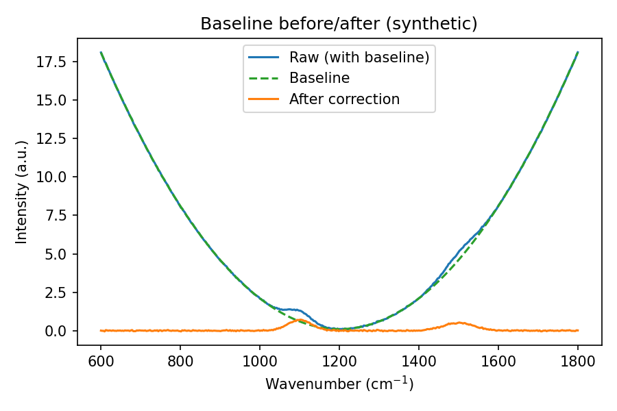
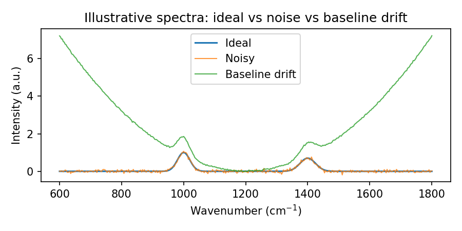

# Baseline Correction

**Purpose:** Remove slowly varying background trends that bias peak-based features and ratios.

**When to use:** Baseline drift from fluorescence (Raman), ATR contact (FTIR), scattering, or instrument response.

**Outcome:** Clean spectra with peaks above zero baseline, suitable for feature extraction and modeling.

---

## Why Baseline Drift Occurs

Baselines drift because of:

- **Fluorescence (Raman):** Broad background from sample excitation that can dwarf weak Raman peaks
- **Scattering/contact (FTIR ATR):** Sloping backgrounds from poor crystal contact or refractive-index mismatches
- **Instrument response:** Slowly varying offsets from detector aging or optical path changes
- **Sample matrix:** Particulates, emulsions, or path-length variations introduce curvature

> For notation and symbols used below, see the [Glossary](../../reference/glossary.md).

## When (Not) to Correct
- **Correct if:** Baseline dominates dynamic range; ratios/areas are biased; spectra share similar baseline shape.
- **Caution if:** Peaks are broad and might be mistaken for baseline; very low SNR; automated correction can remove real signal.
- **Visual check:** Always inspect before/after; consider preserving a copy of raw data.

## Methods in FoodSpec

### Asymmetric Least Squares (ALS)

**Concept:** Fit a smooth baseline minimizing weighted residuals with asymmetric weights that downweight peaks.

**Parameters:**
- `lambda_`: Smoothness (higher = smoother baseline; typical: 1e4–1e6)
- `p`: Asymmetry (0.001–0.1; lower = more aggressive peak suppression)
- `max_iter`: Iterations (10–100)

**When to use:** Moderate to strong baseline curvature; mixed peaks/baseline; most common choice.

**Pitfalls:** Over-smoothing if `lambda_` too large; peak clipping if `p` too small.

### Rubberband (Convex Hull)

**Concept:** Compute lower convex hull of the spectrum and interpolate baseline.

**When to use:** Spectra with clear gaps between peaks and background; quick, parameter-free.

**Pitfalls:** Fails if peaks are dense or baseline above hull; sensitive to noise spikes.

### Polynomial Baseline

**Concept:** Fit low-degree polynomial (1–4) to spectrum or background-only regions.

**When to use:** Mild curvature; simple backgrounds; fast computation.

**Pitfalls:** Overfitting with high polynomial orders; unsuitable for complex fluorescence.

## 4. Practical guidance
- **Order in pipeline:** Baseline → smoothing/normalization → features. Avoid applying after aggressive normalization.
- **Quality checks:** Plot before/after; monitor peak heights/areas; compare across replicates.
- **Parameter tuning:** Start with moderate `lambda_` (e.g., 1e5) and `p` (~0.001–0.01) for ALS; adjust visually.
- If over/under-correction persists, see [Common problems & solutions](../../troubleshooting/common_problems_and_solutions.md#c-preprocessing--chemometric-problems).

## 5. Example (high level)
```python
from foodspec.preprocess.baseline import ALSBaseline

als = ALSBaseline(lambda_=1e5, p=0.001, max_iter=10)
X_corr = als.transform(X_raw)
```

## 6. Visuals to include
- **Baseline before/after (synthetic):** One spectrum with quadratic drift + noise. Show raw (with drift), true baseline, and corrected signal (e.g., subtract known baseline). Axes: wavenumber (cm⁻¹) vs intensity. Purpose: illustrate what a successful correction looks like. See `docs/examples/visualization/generate_baseline_before_after.py`.



- **Drift/noise illustration:** Overlay ideal spectrum, noisy spectrum, and drifted spectrum to show why correction is needed. Axes: wavenumber vs intensity. Generated via `docs/examples/stats/generate_spectral_artifacts_figures.py`.



## Reproducible figure generation
- Run `python docs/examples/visualization/generate_baseline_before_after.py` for baseline before/after.
- Run `python docs/examples/stats/generate_spectral_artifacts_figures.py` for drift/noise illustration.

## Summary
- Baseline correction removes broad backgrounds that bias peak-based features.
- ALS is a flexible default; rubberband is simple; polynomial fits suit mild curvature.
- Always inspect corrections; avoid removing true broad features.

---

## When Results Cannot Be Trusted

⚠️ **Red flags for baseline correction validity:**

1. **Baseline correction removes true spectral features (ALS with low p removes real broad bands)**
   - Aggressive baseline subtraction can eliminate informative signal
   - Ratio calculations biased by removed features
   - **Fix:** Inspect baseline-corrected spectra visually; check that broad true features (e.g., water, baseline) not removed; use moderate ALS parameters (p = 0.01–0.1)

2. **Baseline corrected spectra negative in valid signal regions (spectra have negative intensities post-ALS)**
   - Indicates over-correction; true signal removed
   - Invalid for intensity-based ratios or downstream modeling
   - **Fix:** Reduce ALS aggressiveness (increase p); use gentler smoothing; validate baseline visually

3. **Different baseline methods applied to different samples (some samples ALS, others polynomial)**
   - Inconsistent preprocessing produces incomparable spectra
   - Ratios and models fail across samples
   - **Fix:** Freeze preprocessing parameters before analysis; apply identical method to all samples

4. **Baseline correction applied to over-smoothed spectra (smoothing removes peaks, then baseline correction applied)**
   - Preprocessing order matters; over-smoothing hides information that baseline tries to fit
   - Compounded information loss
   - **Fix:** Apply baseline correction before smoothing; use gentle smoothing after baseline

5. **ALS parameters (lambda, p) chosen by eye ("looks good") without validation**
   - Data-dependent parameter choice overfits; new data may need different parameters
   - Reproducibility and generalization compromised
   - **Fix:** Pre-specify parameters based on spectral characteristics or previous studies; validate on test samples

6. **Baseline features confused with true sample features (matrix baseline treated as signal)**
   - Removing baseline removes chemistry-independent variation but not true matrix peaks
   - Incomplete baseline removal leaves matrix effects
   - **Fix:** Distinguish baseline (smooth, slow trend) from true peaks (sharp, chemical meaning); validate with reference materials

7. **No baseline correction applied to noisy spectra (baseline noise directly affects ratios)**
   - Uneven baseline amplifies noise; ratio variability increased
   - Statistics and reproducibility suffer
   - **Fix:** Always apply baseline correction; use appropriate method (ALS or rolling ball) for spectral type

8. **Spectral regions with true curvature treated as baseline (curvature from sample composition corrected away)**
   - Example: long-wavelength drift in FTIR from sample absorption treated as baseline
   - True information removed
   - **Fix:** Understand physical baseline sources; preserve physically meaningful curvature; inspect corrected spectra

## Further reading
- [Normalization & smoothing](normalization_smoothing.md)
- [Feature extraction](feature_extraction.md)
- [Raman/FTIR practical guide](../preprocessing/baseline_correction.md)
- [PCA](../chemometrics/pca_and_dimensionality_reduction.md)
