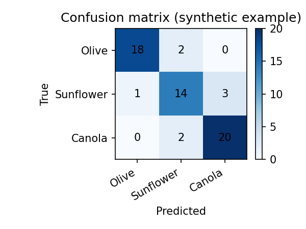
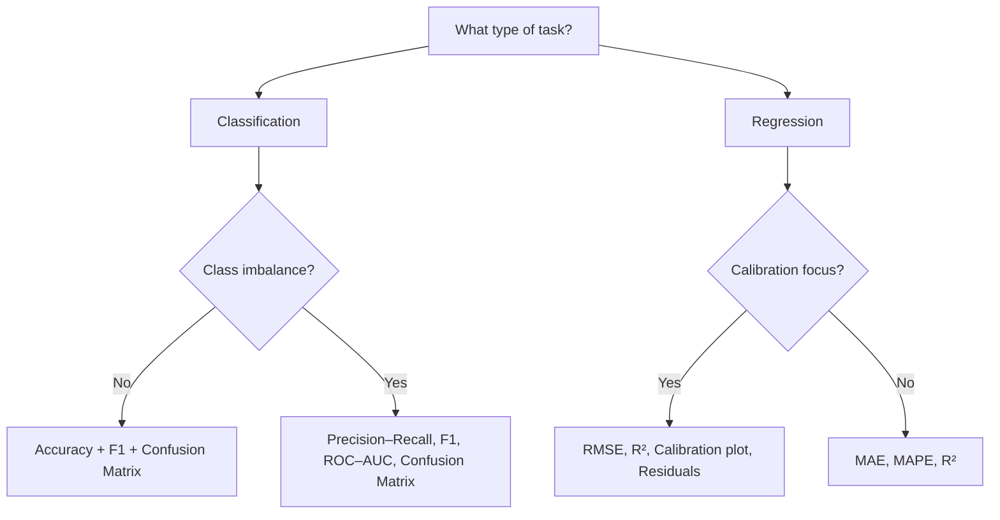

# Metrics & Evaluation

Metrics tell you how well a workflow answers a scientific or QC question. Different food spectroscopy tasks (authentication, adulteration detection, spoilage monitoring, calibration) demand different metrics and plots. This chapter explains what to use, why, and how to interpret results in practice.

> For notation and symbols, see the [Glossary](../glossary.md).

## What?
Defines classification, regression, embedding-structure, and agreement metrics; pairs each with recommended plots. Inputs: true/pred labels or continuous targets (plus scores), embeddings, ratios. Outputs: metric dictionaries, plots (confusion matrix, ROC/PR, calibration, residuals, Bland–Altman), and uncertainty (bootstrapped CI).

## Why?
Spectral tasks span authentication (imbalanced), calibration (bias/precision), and structure exploration (PCA/t-SNE). Metrics + plots + uncertainty prevent overclaiming and align results with chemistry/QA/QC expectations.

## When?
**Use when** you need quantitative evidence for model performance, group separation, or agreement (model vs lab).  
**Limitations:** small n → prefer CIs/bootstraps; imbalanced classes → prefer PR/F1 over accuracy; embeddings are qualitative unless paired with silhouette/between-within metrics.

## Where? (pipeline)
Upstream: preprocessing → features → models/embeddings.  
Downstream: stats tests (ANOVA/Games–Howell on features), reporting (metrics.json, plots).


## 1. Why evaluation metrics matter
- Accuracy alone can mislead (class imbalance, asymmetric costs).
- Authentication/adulteration often prioritizes sensitivity/specificity or precision–recall.
- Regression/calibration needs error magnitudes (RMSE/MAE) and bias checks (calibration plots).
- Regulatory/QC contexts require transparent, interpretable metrics and diagnostics.

## 2. Classification metrics (binary & multi-class)

| Metric | Formula/intuition | When to use | Notes |
| --- | --- | --- | --- |
| Accuracy | (TP+TN)/(all) | Balanced classes | Misleading if imbalance |
| Precision | TP/(TP+FP) | Rare positives, avoid false alarms | High precision = few false positives |
| Recall (Sensitivity) | TP/(TP+FN) | Missing positives is costly | High recall = few false negatives |
| Specificity | TN/(TN+FP) | Avoiding false positives | Pair with sensitivity |
| F1-score | Harmonic mean of precision/recall | Balance precision/recall | Use macro for per-class balance |
| Balanced accuracy | Mean of recall across classes | Imbalance | |
| MCC | Correlation of true vs pred labels | Binary robustness | Handles imbalance |

Confusion matrix: counts per true/pred class; shows where errors occur.  
ROC curve (FPR vs TPR); AUC summarizes ranking ability.  
Precision–Recall curve: better for rare positives.

> **Math box (key classification metrics)**  
> Specificity \(= \\frac{TN}{TN+FP}\); Sensitivity/Recall \(= \\frac{TP}{TP+FN}\)  
> MCC \(= \\frac{TP\\times TN - FP\\times FN}{\\sqrt{(TP+FP)(TP+FN)(TN+FP)(TN+FN)}}\)  
> F1 \(= 2 \\cdot \\frac{\\text{precision}\\cdot\\text{recall}}{\\text{precision}+\\text{recall}}\)

**Food task → best metrics**
| Task | Metrics | Reason |
| --- | --- | --- |
| Authentication | Sensitivity + specificity | False negatives/positives both matter |
| Adulteration (rare) | Precision–recall, F1_macro | Rare-event imbalance |
| Multi-class oil ID | F1_macro, balanced accuracy | Per-class balance |
| Spoilage detection | ROC–AUC + recall | Missing spoiled samples is critical |

### Code example
```python
from foodspec.metrics import compute_classification_metrics
from foodspec.viz import plot_confusion_matrix, plot_roc_curve

res = compute_classification_metrics(y_true, y_pred, labels=class_labels, average="macro", y_scores=y_scores)
print(res["accuracy"], res["f1"])
plot_confusion_matrix(res["confusion_matrix"], class_labels)
if "roc_curve" in res:
    fpr, tpr = res["roc_curve"]
    plot_roc_curve(fpr, tpr, res.get("auc"))
```



*Figure: Synthetic confusion matrix illustrating per-class errors and supports.*

### Metrics selection flowchart


For practical examples with real models, see [Machine Learning & Deep Learning Models](../ml/models_and_best_practices.md).

## 3. Regression & calibration metrics

| Metric | Intuition | When to use |
| --- | --- | --- |
| RMSE | Penalizes large errors | Calibration, continuous targets |
| MAE | Median-like robustness | Outliers present |
| R² | Variance explained | Overall fit |
| MAPE | Relative (%) error | Scale-free, beware near-zero targets |

Diagnostics: predicted vs true, residual plots, calibration (bias/slope).  
Use RMSE/MAE for magnitude; R² for proportion explained; MAPE for relative comparisons.

> **Math box (key regression metrics)**  
> RMSE \(= \\sqrt{\\frac{1}{n}\\sum (y-\\hat y)^2}\); MAE \(= \\frac{1}{n}\\sum |y-\\hat y|\)  
> \(R^2 = 1 - \\frac{\\sum (y-\\hat y)^2}{\\sum (y-\\bar y)^2}\\); Adjusted \(R^2 = 1 - (1-R^2)\\frac{n-1}{n-p-1}\)  
> MAPE \(= \\frac{100}{n}\\sum \\left|\\frac{y-\\hat y}{y}\\right|\) (beware near zero targets)

### Code example
```python
from foodspec.metrics import compute_regression_metrics
from foodspec.viz import plot_regression_calibration, plot_residuals

res = compute_regression_metrics(y_true, y_pred)
print(res["rmse"], res["r2"])
plot_regression_calibration(y_true, y_pred)
plot_residuals(y_true, y_pred)
```

## 4. Statistical metrics and effect sizes
- Effect size: Cohen’s d (two groups), eta²/partial eta² (ANOVA).
- Confidence intervals and standard errors contextualize magnitude.
- ANOVA outputs (F, p) should be paired with effect sizes and post-hoc tests.

## 5. Quantifying structure in embeddings (PCA/t-SNE)
- **Silhouette score:** Measures how similar a sample is to its own class vs other classes (range -1 to 1). Higher = better separation.
- **Between/within scatter ratio:** Ratio of average distances between class centroids to average within-class variance. >1 suggests separation; ~1 suggests overlap.
- **F-like statistic & permutation p-value:** Between/within is analogous to an ANOVA F on the embedding. A permutation p-value (p_perm) tests whether the observed ratio is larger than random labelings.

```python
from foodspec.metrics import (
    compute_embedding_silhouette,
    compute_between_within_ratio,
    compute_between_within_stats,
)

# Assume scores from PCA or t-SNE and integer labels
sil = compute_embedding_silhouette(scores[:, :2], labels)
bw = compute_between_within_ratio(scores[:, :2], labels)
stats = compute_between_within_stats(scores[:, :2], labels, n_permutations=200, random_state=0)
print(f"silhouette={sil:.2f}, bw={bw:.2f}, f={stats['f_stat']:.2f}, p_perm={stats['p_perm']:.3f}")
```

When to use: pair these metrics with PCA/t-SNE plots to avoid over-interpreting visuals; low silhouette or high p_perm suggests weak separation. For visuals (PCA scores/loadings and t-SNE) and reproducible figures, run
`python docs/examples/visualization/generate_embedding_figures.py`, which saves
`pca_scores.png`, `pca_loadings.png`, and `tsne_scores.png` using synthetic spectra.

## 6. Robustness (bootstrap/permutation)
```python
from foodspec.stats.robustness import bootstrap_metric
from foodspec.metrics import compute_classification_metrics

def f1_metric(y_true, y_pred):
    return compute_classification_metrics(y_true, y_pred)["f1"]

obs, ci = bootstrap_metric(f1_metric, y_true, y_pred, n_bootstrap=200, random_state=0)
print(\"Observed F1\", obs, \"CI\", ci)
```
Bootstraps (or permutation tests) provide uncertainty around metrics; use them when sample sizes are small or decisions are high-stakes.

### Bootstrap confidence intervals for metrics
```python
from foodspec.metrics import bootstrap_metric_ci, compute_regression_metrics

rmse_fn = lambda yt, yp: compute_regression_metrics(yt, yp)["rmse"]
ci = bootstrap_metric_ci(y_true, y_pred, rmse_fn, n_bootstrap=500, alpha=0.05, random_state=0)
print(ci["metric"], ci["ci_low"], ci["ci_high"])
```
Use for accuracy/F1 or regression errors; CIs help communicate uncertainty around performance.

### Agreement plots (Bland–Altman)
When comparing methods (e.g., model vs lab reference), use a Bland–Altman plot to show bias and limits of agreement:
```python
from foodspec.viz import plot_bland_altman
ax = plot_bland_altman(y_true, y_pred)
```
Interpret bias (mean diff) and limits (mean ± 1.96 SD). Systematic trends in diff vs mean indicate scale/offset issues.

## 7. Visualization & diagnostic plots
- **Confusion matrix**: where classification fails; interpret per-class errors.
- **ROC curve/AUC**: ranking ability; use for balanced/varied thresholds.
- **Precision–Recall curve**: rare positives/adulteration.
- **Calibration curve & residuals**: regression bias and spread.
- **Correlation heatmap**: associations among ratios/PCs/quality metrics.
- **PCA scores/loadings**: structure and band importance (contextual).

## 8. Metrics in workflows
- **Oil authentication**: F1_macro, balanced accuracy; confusion matrix; ROC if binary; ANOVA/Tukey on key ratios.
- **Adulteration (rare)**: precision–recall, F1, PR curve; confusion matrix with class counts.
- **Heating degradation (regression/time)**: RMSE/MAE/R²; correlation of ratios vs time; residual plots.
- **Mixtures/calibration**: RMSE/MAE/R²/MAPE; predicted vs true; residuals; optional PR for thresholded tasks.
- **Batch QC**: confusion matrix for in/ out-of-distribution labels; specificity/sensitivity for QC thresholds.
For practical model choices and troubleshooting, see [ML & DL models](../ml/models_and_best_practices.md) and [Common problems & solutions](../troubleshooting/common_problems_and_solutions.md).

## 9. Practical guidance
- Always report class supports and per-class metrics.
- Use PR curves for rare events; ROC for balanced classification.
- Pair p-values with effect sizes; pair metrics with uncertainty (CI/bootstrap).
- Show diagnostic plots alongside headline numbers.

## 10. Group-difference validation
When comparing spectral features (ratios/peaks) across groups, complement metrics with statistical tests:
- **MANOVA** to test multivariate group differences across several ratios/PCs.
- **Games–Howell** post-hoc after ANOVA/Kruskal when variances/group sizes differ; safer for many spectroscopic datasets.
See [ANOVA & MANOVA](../stats/anova_and_manova.md) for theory and code.

## See also
- [Visualization with FoodSpec](../visualization/plotting_with_foodspec.md)
- [Classification & regression](../ml/classification_regression.md)
- [Calibration/regression workflow](../workflows/calibration_regression_example.md)
- [Workflow design & reporting](../workflows/workflow_design_and_reporting.md)
- [Stats: hypothesis testing](../stats/hypothesis_testing_in_food_spectroscopy.md)
- [Troubleshooting common problems](../troubleshooting/common_problems_and_solutions.md)
