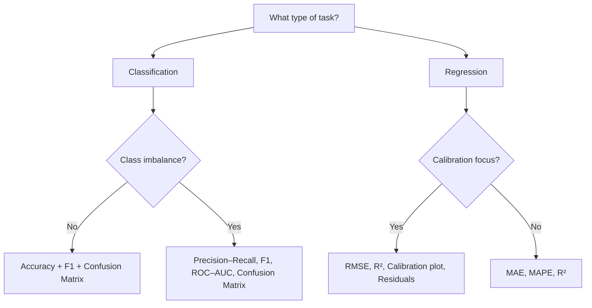

# Metrics & Evaluation

Metrics tell you how well a workflow answers a scientific or QC question. Different food spectroscopy tasks (authentication, adulteration detection, spoilage monitoring, calibration) demand different metrics and plots. This chapter explains what to use, why, and how to interpret results in practice.

## 1. Why evaluation metrics matter
- Accuracy alone can mislead (class imbalance, asymmetric costs).
- Authentication/adulteration often prioritizes sensitivity/specificity or precision–recall.
- Regression/calibration needs error magnitudes (RMSE/MAE) and bias checks (calibration plots).
- Regulatory/QC contexts require transparent, interpretable metrics and diagnostics.

## 2. Classification metrics (binary & multi-class)

| Metric | Formula/intuition | When to use | Notes |
| --- | --- | --- | --- |
| Accuracy | (TP+TN)/(all) | Balanced classes | Misleading if imbalance |
| Precision | TP/(TP+FP) | Rare positives, avoid false alarms | High precision = few false positives |
| Recall (Sensitivity) | TP/(TP+FN) | Missing positives is costly | High recall = few false negatives |
| Specificity | TN/(TN+FP) | Avoiding false positives | Pair with sensitivity |
| F1-score | Harmonic mean of precision/recall | Balance precision/recall | Use macro for per-class balance |
| Balanced accuracy | Mean of recall across classes | Imbalance | |
| MCC | Correlation of true vs pred labels | Binary robustness | Handles imbalance |

Confusion matrix: counts per true/pred class; shows where errors occur.  
ROC curve (FPR vs TPR); AUC summarizes ranking ability.  
Precision–Recall curve: better for rare positives.

**Food task → best metrics**
| Task | Metrics | Reason |
| --- | --- | --- |
| Authentication | Sensitivity + specificity | False negatives/positives both matter |
| Adulteration (rare) | Precision–recall, F1_macro | Rare-event imbalance |
| Multi-class oil ID | F1_macro, balanced accuracy | Per-class balance |
| Spoilage detection | ROC–AUC + recall | Missing spoiled samples is critical |

### Code example
```python
from foodspec.metrics import compute_classification_metrics
from foodspec.viz import plot_confusion_matrix, plot_roc_curve

res = compute_classification_metrics(y_true, y_pred, labels=class_labels, average="macro", y_scores=y_scores)
print(res["accuracy"], res["f1"])
plot_confusion_matrix(res["confusion_matrix"], class_labels)
if "roc_curve" in res:
    fpr, tpr = res["roc_curve"]
    plot_roc_curve(fpr, tpr, res.get("auc"))
```

### Metrics selection flowchart


For practical examples with real models, see [Machine Learning & Deep Learning Models](../ml/models_and_best_practices.md).

## 3. Regression & calibration metrics

| Metric | Intuition | When to use |
| --- | --- | --- |
| RMSE | Penalizes large errors | Calibration, continuous targets |
| MAE | Median-like robustness | Outliers present |
| R² | Variance explained | Overall fit |
| MAPE | Relative (%) error | Scale-free, beware near-zero targets |

Diagnostics: predicted vs true, residual plots, calibration (bias/slope).  
Use RMSE/MAE for magnitude; R² for proportion explained; MAPE for relative comparisons.

### Code example
```python
from foodspec.metrics import compute_regression_metrics
from foodspec.viz import plot_regression_calibration, plot_residuals

res = compute_regression_metrics(y_true, y_pred)
print(res["rmse"], res["r2"])
plot_regression_calibration(y_true, y_pred)
plot_residuals(y_true, y_pred)
```

## 4. Statistical metrics and effect sizes
- Effect size: Cohen’s d (two groups), eta²/partial eta² (ANOVA).
- Confidence intervals and standard errors contextualize magnitude.
- ANOVA outputs (F, p) should be paired with effect sizes and post-hoc tests.

## 5. Visualization & diagnostic plots
- **Confusion matrix**: where classification fails; interpret per-class errors.
- **ROC curve/AUC**: ranking ability; use for balanced/varied thresholds.
- **Precision–Recall curve**: rare positives/adulteration.
- **Calibration curve & residuals**: regression bias and spread.
- **Correlation heatmap**: associations among ratios/PCs/quality metrics.
- **PCA scores/loadings**: structure and band importance (contextual).

## 6. Metrics in workflows
- **Oil authentication**: F1_macro, balanced accuracy; confusion matrix; ROC if binary; ANOVA/Tukey on key ratios.
- **Adulteration (rare)**: precision–recall, F1, PR curve; confusion matrix with class counts.
- **Heating degradation (regression/time)**: RMSE/MAE/R²; correlation of ratios vs time; residual plots.
- **Mixtures/calibration**: RMSE/MAE/R²/MAPE; predicted vs true; residuals; optional PR for thresholded tasks.
- **Batch QC**: confusion matrix for in/ out-of-distribution labels; specificity/sensitivity for QC thresholds.
For practical model choices and troubleshooting, see [ML & DL models](../ml/models_and_best_practices.md) and [Common problems & solutions](../troubleshooting/common_problems_and_solutions.md).

## 7. Practical guidance
- Always report class supports and per-class metrics.
- Use PR curves for rare events; ROC for balanced classification.
- Pair p-values with effect sizes; pair metrics with uncertainty (CI/bootstrap).
- Show diagnostic plots alongside headline numbers.

## See also
- [Visualization with FoodSpec](../visualization/plotting_with_foodspec.md)
- [Classification & regression](../ml/classification_regression.md)
- [Calibration/regression workflow](../workflows/calibration_regression_example.md)
- [Workflow design & reporting](../workflows/workflow_design_and_reporting.md)
- [Stats: hypothesis testing](../stats/hypothesis_testing_in_food_spectroscopy.md)
- [Troubleshooting common problems](../troubleshooting/common_problems_and_solutions.md)
