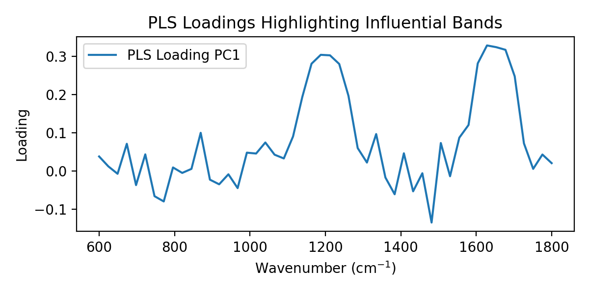

# Model Interpretability in FoodSpec

Questions this page answers:
- How can I interpret ML/DL models applied to spectra?
- Which tools does FoodSpec provide for feature importance and latent factors?
- How should interpretability be reported in food spectroscopy studies?

## Why interpretability matters
- Connects spectral features to chemistry (e.g., unsaturation bands).
- Builds trust for QA/QC and regulatory contexts.
- Helps diagnose spurious correlations or leakage.

## Tools in FoodSpec
- **PCA/PLS loadings:** via `plot_pca_loadings` and PLS loadings to identify influential wavenumbers/peaks.
- **Random Forest feature importances:** inspect `feature_importances_`; relate top bands to chemistry.
- **Peak/ratio-based features:** inherently interpretable; report definitions and effect directions.
- **Confusion matrices and per-class metrics:** clarify where models struggle.
- **Residuals and calibration plots:** show bias and spread in regression.

## Practical examples
```python
from foodspec.chemometrics.pca import run_pca
from foodspec.viz import plot_pca_loadings

pca, res = run_pca(X, n_components=2)
plot_pca_loadings(res.loadings, wavenumbers, components=(1, 2))
```

```python
# RF feature importances
rf = make_classifier("rf", n_estimators=200, random_state=42)
rf.fit(X, y)
importances = rf.feature_importances_
```

For PLS-DA/PLS regression, examine loading vectors and VIP-like interpretations; ensure preprocessing is consistent across train/test.

## Visual examples

*Figure: RF feature importances on synthetic spectra. Top bands correspond to simulated peaks; relate them to known chemical bands.*


*Figure: PLS loadings for the first component, showing influential wavenumbers in a calibration task.*

## Reporting guidance
- Report top contributing bands/ratios and their chemical meaning.
- Include loadings/importance plots in supplementary material; summarize key drivers in main text.
- Avoid over-interpretation of noisy or collinear features; cross-check with domain knowledge.
- Pair interpretability with metrics: a model that performs poorly but shows plausible bands still needs improved performance.

## See also
- Metrics & evaluation: [metrics_and_evaluation](../metrics/metrics_and_evaluation.md)
- ML models & best practices: [models_and_best_practices](models_and_best_practices.md)
- Stats: [ANOVA & MANOVA](../stats/anova_and_manova.md) for group-level effects
- Troubleshooting: [common_problems_and_solutions](../troubleshooting/common_problems_and_solutions.md)
