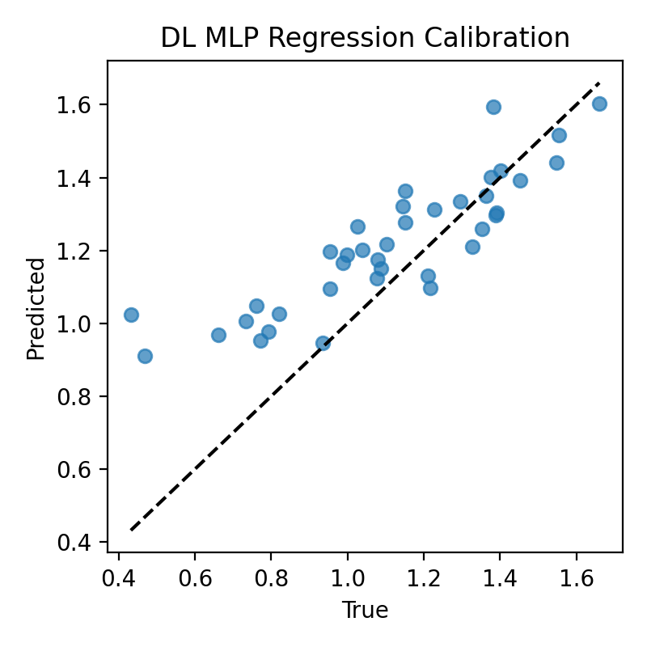

# ML & DL models and best practices in FoodSpec

Questions this page answers:
- Why do we need ML/DL for spectroscopy, and what challenges do spectra present?
- Which model families are available in FoodSpec and when should I use each?
- How do models connect to metrics, plots, and workflows (oil auth, heating, QC, calibration)?
- What are the best practices for splitting data, avoiding leakage, and interpreting results?

## 1. Why ML & DL matter in spectroscopy
- Spectra are high-dimensional, highly correlated (small n / large p), and often noisy.
- Predictive models help with authentication, adulteration detection, spoilage identification, calibration of continuous properties, and QC flagging.
- FoodSpec provides well-scoped classical models and an optional deep model, all evaluated via `foodspec.metrics` and visualized with `foodspec.viz`.

See also:
- Preprocessing & chemometrics: [baseline, normalization, PCA](../preprocessing/feature_extraction.md)
- Metrics & evaluation: [metrics/metrics_and_evaluation.md](../metrics/metrics_and_evaluation.md)
- Visualization: [plotting_with_foodspec.md](../visualization/plotting_with_foodspec.md)

## 2. Model families and when to use them

### Linear / margin-based
- **Logistic regression** (`make_classifier("logreg")`): fast, interpretable; good baseline for well-separated classes; regularization helps small-n/large-p.
- **Linear SVM** (`make_classifier("svm_linear")`): strong linear margin; performs well on high-dimensional spectra; tune C.
- **PLS / PLS-DA** (`make_pls_regression`, `make_pls_da`): chemometric standard for calibration and discriminant analysis; captures latent factors; tune components.

### Non-linear
- **RBF SVM** (`make_classifier("svm_rbf")`): handles non-linear decision boundaries; requires kernel parameters (C, gamma); watch for scaling and overfitting.
- **Random Forest** (`make_classifier("rf")`): robust to mixed signals, offers feature importances; useful when peak subsets drive class differences.
- **k-NN** (`make_classifier("knn")`): simple, instance-based; good quick baseline; sensitive to scaling and class imbalance.

### Regression / calibration
- **PLS Regression** (`make_pls_regression`): preferred for spectral calibration (e.g., moisture, quality index).
- **Linear/ElasticNet Regression** (via scikit-learn estimators): for simple linear relationships; add regularization for stability.

### Deep learning (optional)
- **Conv1DSpectrumClassifier** (`foodspec.chemometrics.deep`): 1D CNN for spectra; optional extra dependency; useful when non-linear, local patterns matter. Use cautiously with limited data; cross-validate carefully. Normalize inputs and consider early stopping/dropout.
- **MLP (conceptual)**: A fully connected network can approximate non-linear calibrations; benchmark against PLS and keep architectures small for limited datasets.

## 3. Choosing the right model

### Model selection flowchart
```mermaid
flowchart TD
    A[What is your task?] --> B[Classification]
    A --> C[Regression / Calibration]

    B --> B1{Dataset size?}
    B1 -->|Small / linear-ish| B2[Logistic Regression or SVM (linear)]
    B1 -->|Larger or non-linear| B3[RBF SVM or Random Forest]

    C --> C1{Strong linear relation?}
    C1 -->|Yes| C2[PLS Regression]
    C1 -->|No / non-linear| C3[MLP or other non-linear model]
```

Task-to-model mapping:
- Authentication / multi-class oils: linear SVM, RBF SVM, RF; start simple (logreg) as baseline.
- Rare adulteration/spoilage (imbalance): linear/RBF SVM with class weights, RF; evaluate with PR curves.
- Calibration (quality index, moisture): PLS regression; consider non-linear (MLP) if bias remains.
- Quick baselines / interpretability: k-NN, logistic regression, RF feature importances.

## 4. Best practices
- **Splits and CV:** Use stratified splits for classification; cross-validation for small datasets. Keep preprocessing (baseline, scaling, PCA/PLS) inside pipelines to avoid leakage.
- **Scaling:** Many models expect scaled inputs; use vector/area norm or StandardScaler where appropriate.
- **Hyperparameters:** Start with defaults; tune key knobs (C/gamma for SVM, n_estimators/depth for RF, components for PLS/PCA).
- **Imbalance:** Prefer F1_macro, balanced accuracy, precision–recall curves for rare adulteration/spoilage events.
- **Overfitting checks:** Monitor train vs validation metrics; use permutation/bootstraps (`foodspec.stats.robustness`) when in doubt.
- **Reproducibility:** Fix random seeds, record configs, and export run metadata via `foodspec.reporting.export_run_metadata`.

## Classification example (PCA + SVM)
```python
import numpy as np
from sklearn.pipeline import make_pipeline
from sklearn.decomposition import PCA
from foodspec.chemometrics.models import make_classifier
from foodspec.metrics import compute_classification_metrics
from foodspec.viz import plot_confusion_matrix

X_train, X_test, y_train, y_test = ...  # spectra arrays
clf = make_pipeline(PCA(n_components=10), make_classifier("svm_rbf"))
clf.fit(X_train, y_train)
y_pred = clf.predict(X_test)
metrics = compute_classification_metrics(y_test, y_pred)
plot_confusion_matrix(metrics["confusion_matrix"], class_labels=np.unique(y_test))
```

Use when: non-linear class boundaries (e.g., subtle oil-type differences). Interpret using F1_macro and confusion matrix; add ROC/PR when scores are available.

## Regression / calibration example (PLS)
```python
from foodspec.chemometrics.models import make_pls_regression
from foodspec.metrics import compute_regression_metrics
from foodspec.viz import plot_regression_calibration, plot_residuals

pls = make_pls_regression(n_components=8)
pls.fit(X_train, y_train)           # e.g., quality index or concentration
y_pred = pls.predict(X_test).ravel()
reg_metrics = compute_regression_metrics(y_test, y_pred)
ax = plot_regression_calibration(y_test, y_pred)
plot_residuals(y_test, y_pred)
```

Use when: calibrating continuous properties (moisture, peroxide value). Interpret RMSE/MAE and R²; inspect residual plots for bias.

## Deep learning note (optional)
```python
# pip install foodspec[deep]
from foodspec.chemometrics.deep import Conv1DSpectrumClassifier
from foodspec.metrics import compute_classification_metrics

model = Conv1DSpectrumClassifier(n_filters=16, n_epochs=20, batch_size=32, random_state=42)
model.fit(X_train, y_train)
probs = model.predict_proba(X_test)
y_pred = model.predict(X_test)
metrics = compute_classification_metrics(y_test, y_pred)
print("DL accuracy:", metrics["accuracy"])
```
Use when you have enough data and expect local spectral patterns. Always benchmark against classical baselines and report metrics with confidence intervals.

### DL regression example

*Figure: MLP regression predicted vs true on synthetic spectral features (generated via `docs/examples/dl/generate_mlp_regression_example.py`). Points near the diagonal indicate good calibration; deviations show bias/noise.*

Use DL regression only when you have ample data and non-linear relationships; always compare with PLS/linear baselines and robust validation.

## 5. Metrics bridge
- **Classification:** accuracy, F1_macro, balanced accuracy; confusion matrix, ROC/PR curves.
- **Regression:** RMSE, MAE, R², MAPE; calibration and residual plots.
- **Workflows:** oil authentication → SVM/RF + confusion matrix; heating degradation → regression/PLS + trends; QC/novelty → one-class models + score distributions.

For detailed definitions and examples of each metric, see [Metrics & Evaluation](../metrics/metrics_and_evaluation.md). Plotting utilities are in [Visualization & Diagnostic Plots](../visualization/plotting_with_foodspec.md).
For common pitfalls and fixes (imbalance, overfitting, data leakage), see [Common problems & solutions](../troubleshooting/common_problems_and_solutions.md).

## 6. Example end-to-end workflows
- Classification (oil authentication): load spectra (CSV/JCAMP/OPUS) with `foodspec.io.read_spectra` → preprocess (baseline, normalization, PCA) → train SVM/RF → `compute_classification_metrics` → `plot_confusion_matrix`/ROC/PR → interpret misclassifications.
- Regression (calibration): load spectra → PLS regression → `compute_regression_metrics` → calibration + residual plots → check bias and heteroscedasticity.

For broader workflow context, see [oil authentication](../workflows/oil_authentication.md) and [calibration/regression example](../workflows/calibration_regression_example.md).

## 7. Summary and pointers
- Choose the simplest model that answers the question; benchmark against baselines.
- Use the right metrics for the task and class balance; see [Metrics & Evaluation](../metrics/metrics_and_evaluation.md).
- Keep preprocessing in pipelines to avoid leakage; see [Preprocessing & chemometrics](../preprocessing/feature_extraction.md).
- Record configs and export run metadata for reproducibility; see [Reporting guidelines](../reporting_guidelines.md).
- For model theory and tuning, continue to [Model evaluation & validation](model_evaluation_and_validation.md).
