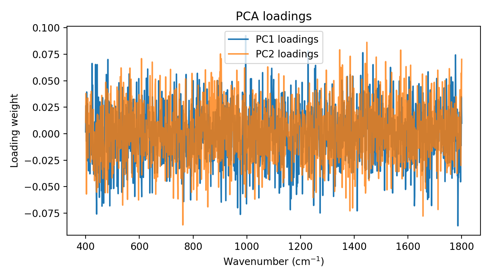
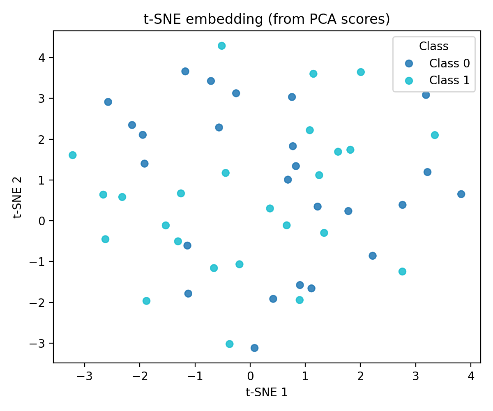

# ML & Chemometrics: PCA and Dimensionality Reduction

Principal Component Analysis (PCA) summarizes high-dimensional spectra into a few orthogonal components. It is a workhorse for exploration, outlier detection, and pre-model checks in food spectroscopy.

> For notation and symbols used below, see the [Glossary](../glossary.md).

## 1. Why dimensionality reduction?
- Spectra can have thousands of wavenumbers; many are correlated.
- PCA finds directions of maximum variance, reducing noise and highlighting structure (clusters by oil type, batch effects, instrument drift).
- Scores plots help visualize separability and spot adulteration or degradation trends before supervised modeling.

## 2. PCA concepts (brief math)
- Center data \(X\) (n_samples × n_features). Covariance \( \Sigma = \frac{1}{n-1} X^\top X \).
- Eigen-decompose \( \Sigma = V \Lambda V^\top \); columns of \(V\) are loadings, \( \Lambda \) are variances.
- Scores \( S = X V \) project spectra; explained variance ratio \( \lambda_i / \sum \lambda \).

> **Math box (PLS sketch)**  
> PLS finds latent variables maximizing covariance between \(X\) (spectra) and \(Y\) (targets).  
> It iterates weight vectors so that scores \(T = X w\) explain both spectral variance and predict \(Y\). Useful for calibration/regression.

## 3. Interpreting scores and loadings
- **Scores plot:** PC1 vs PC2 colored by metadata (oil_type, heating_time). Clusters suggest separability; outliers may be bad spectra or novel samples.
- **Loadings plot:** Loadings vs wavenumber show which bands drive each PC. Peaks in loadings link to chemical groups.
- **Cautions:** PCA is unsupervised; variance may reflect noise or baseline if preprocessing is weak. Ensure baseline/normalization is done first.
- **How to read (worked example):** If oil A and B separate along PC1 and PC1 loadings have strong positive contributions near ~1655 cm⁻¹ (C=C stretch), that band is characteristic of oil A relative to B. Use [Spectroscopy basics](../foundations/spectroscopy_basics.md) for vibrational assignments.

## 4. Practical patterns in food spectroscopy
- **Oil authentication:** PC1/PC2 often separate oil families; loadings highlight unsaturation/ester bands.
- **Heating studies:** PC trends can correlate with time/temperature; loadings show oxidation markers.
- **QC/novelty:** Outliers in score space can flag suspect batches or spectral artifacts.

## 5. Example (high level)
```python
from foodspec.chemometrics.pca import run_pca
from foodspec.viz.pca import plot_pca_scores, plot_pca_loadings

pca, res = run_pca(X_proc, n_components=3)
fig_scores = plot_pca_scores(res.scores[:, :2], labels=fs.metadata["oil_type"])
fig_load = plot_pca_loadings(res.loadings[:, 0], wavenumbers=fs.wavenumbers)
# Quantify structure
from foodspec.metrics import compute_embedding_silhouette, compute_between_within_ratio
sil = compute_embedding_silhouette(res.scores[:, :2], fs.metadata["oil_type"])
bw = compute_between_within_ratio(res.scores[:, :2], fs.metadata["oil_type"])
print(sil, bw)
```

## 6. Visuals to include
- **Scree plot:** Explained variance ratio vs component index from `res.explained_variance_ratio_`.
- **Scores plot:** PC1 vs PC2 colored by metadata (e.g., oil_type); use `plot_pca_scores`. Axes: PC scores; interpret clustering/outliers. Example using synthetic Raman data:

  

  *Interpretation: Classes overlap mildly (silhouette ~0.03, between/within ~0.59), indicating weak separation in this synthetic example.*

- **Loadings plot:** Loadings vs wavenumber with annotated bands (e.g., unsaturation/carbonyl); use `plot_pca_loadings`.

  

  *Interpretation: Peaks in loadings highlight wavenumbers that drive separation (connect to vibrational modes in [Spectroscopy basics](../foundations/spectroscopy_basics.md)).*

- **Optional t-SNE:** If nonlinear structure is suspected, project PCA scores (or preprocessed spectra) with t-SNE for visualization only; interpret clusters with silhouette/between-within metrics on the embedding.

  

  *Interpretation: t-SNE emphasizes local neighbourhoods; always pair with metrics (silhouette, between/within) to avoid over-interpreting visual clusters.*

## Reproducible figure generation
- Run `python docs/examples/visualization/generate_embedding_figures.py` to recreate the synthetic PCA/t-SNE figures above (`pca_scores.png`, `pca_loadings.png`, `tsne_scores.png`).
- For real data, use `run_pca` on the example oils dataset after preprocessing; generate scree/scores/loadings with `foodspec.viz.pca`. Axes and labels as above; color by oil_type or time for interpretation.
- Pair every plot with quantitative metrics: `compute_embedding_silhouette` and `compute_between_within_stats` (reports ratio, F-like statistic, p_perm).

## t-SNE (optional)
- Nonlinear visualization for complex manifolds; sensitive to parameters (perplexity, learning rate).
- Use for visualization only; do not train models on t-SNE space. Compute silhouette/between-within on the t-SNE embedding to quantify separation.
- Example: run PCA → take scores → apply t-SNE to 2D → plot colored by oil_type; report silhouette (e.g., 0.6 indicates reasonable separation).

## Summary
- PCA reduces dimensionality and reveals structure; interpret scores and loadings in chemical context.
- Good preprocessing (baseline, normalization) is essential to avoid baselines dominating PCs.
- Use PCA/t-SNE for exploration, QC, and as a sanity check before supervised models; pair plots with quantitative metrics (silhouette, between/within).

## Further reading
- [Classification & regression](classification_regression.md)
- [Baseline correction](../preprocessing/baseline_correction.md)
- [Normalization & smoothing](../preprocessing/normalization_smoothing.md)
