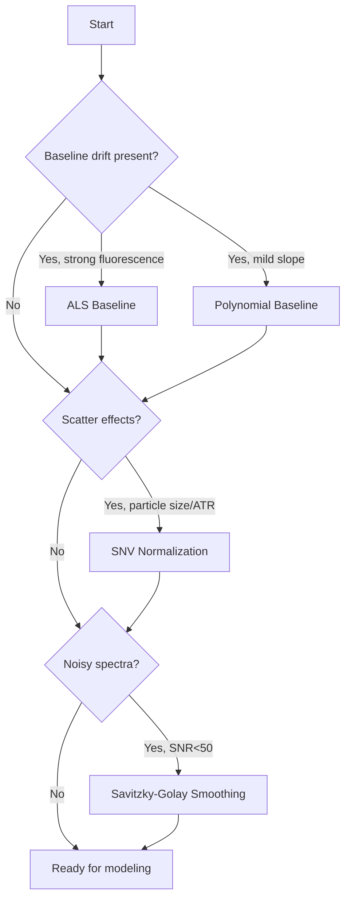
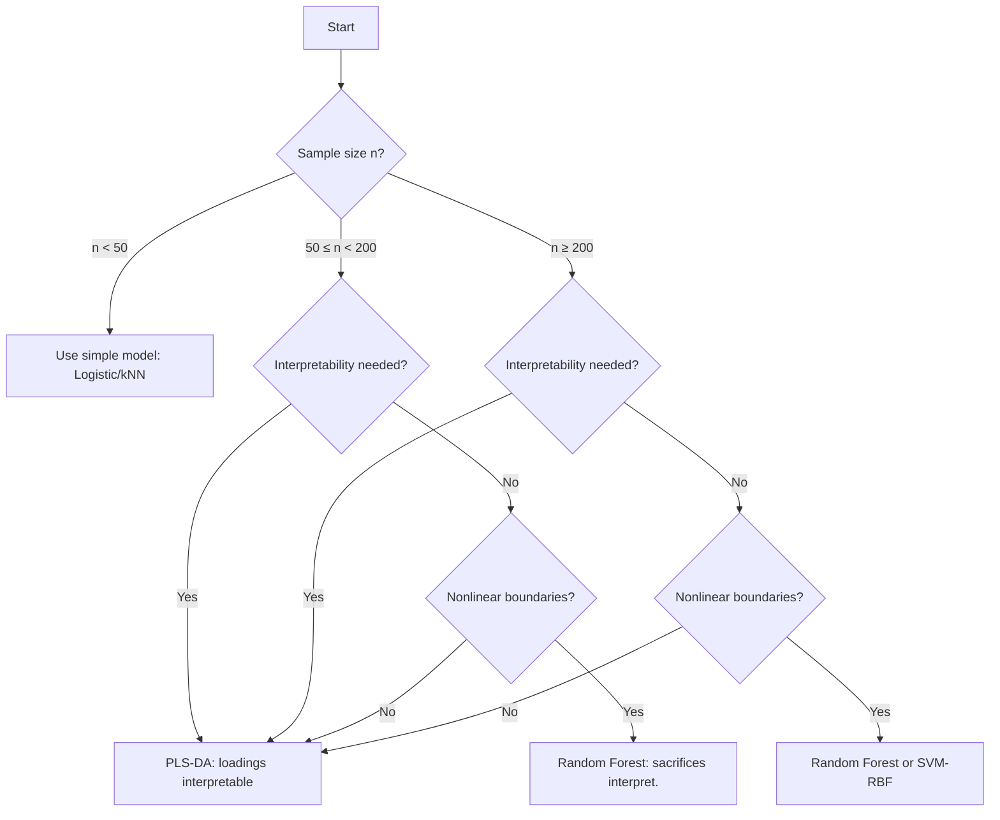
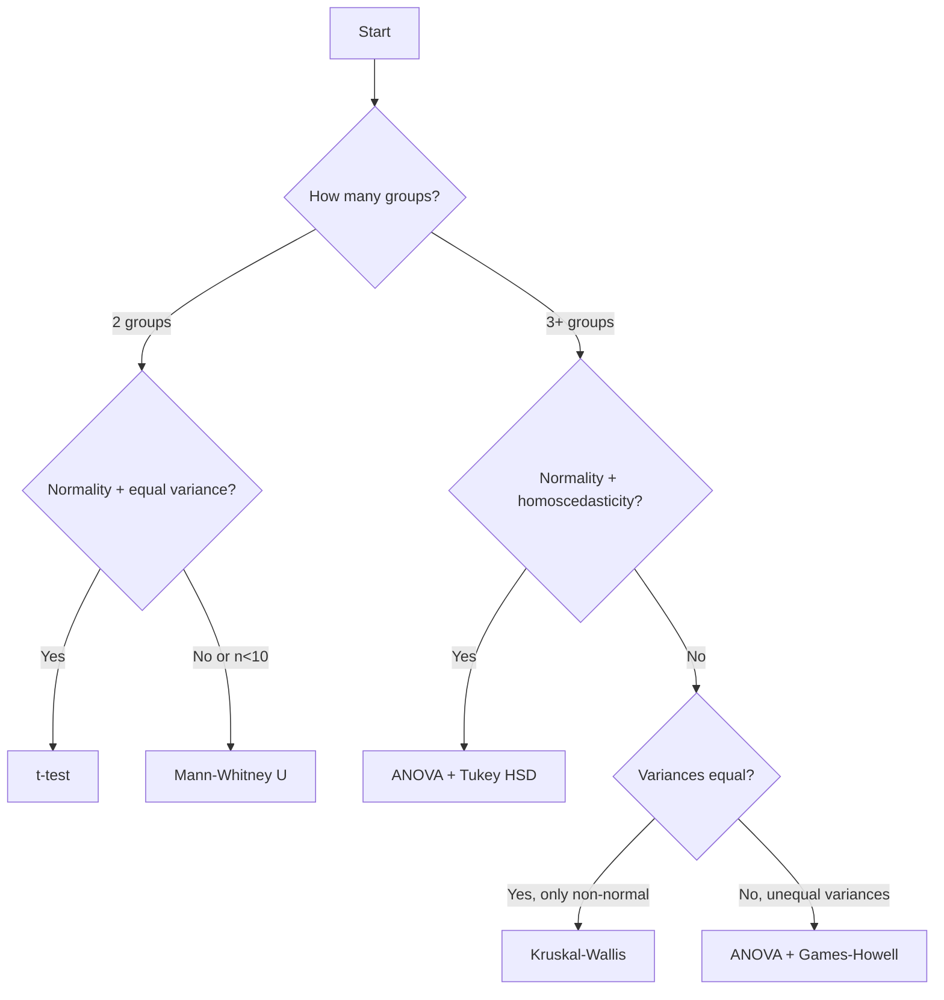

# Method Comparison Matrix

**Purpose:** Compare canonical methods across key performance dimensions to guide method selection  
**Audience:** Researchers, analysts, QC engineers selecting methods for food spectroscopy applications  
**Time to read:** 15-20 minutes

---

## Overview

FoodSpec supports 142+ methods across preprocessing, chemometrics, validation, and statistics. This page compares **20 canonical methods** using **12 standardized axes** to help you choose the right approach for your application.

### How to Use This Page

1. **Identify your workflow stage**: Preprocessing → Modeling → Validation → Statistical Testing
2. **Check your constraints**: Sample size, instrument variation, interpretability needs
3. **Find methods rated high (○) on your priority axes**
4. **Review decision flowcharts** for guided selection

### Rating Scale

| Symbol | Numeric | Meaning |
|--------|---------|---------|
| ○ | 3 | High/Good/Robust/Broad compatibility |
| ◐ | 2 | Medium/Moderate/Some limitations |
| ● | 1 | Low/Poor/Strict requirements/Narrow scope |

---

## Comparison Axes (Summary)

Full definitions are summarized below in the Comparison Axes section.

| Axis | Low (●) | Medium (◐) | High (○) |
|------|---------|-----------|----------|
| **1. Data Requirements** | n < 30 | 30 ≤ n < 100 | n ≥ 100 |
| **2. Baseline Sensitivity** | Critically sensitive | Tolerates mild drift | Immune/corrected |
| **3. Scatter Sensitivity** | Directly confounded | Introduces noise | Immune/normalized |
| **4. Instrument Robustness** | Requires calibration transfer | Periodic QC | Inherently robust |
| **5. Interpretability** | Black-box | Requires expertise | Direct chemical meaning |
| **6. Computational Cost** | >60s or GPU | 1-60s | <1s |
| **7. Assumptions** | Strict (normality) | Moderate (linearity) | Few/none |
| **8. SNR Requirements** | SNR > 50 | SNR 10-50 | SNR < 10 tolerated |
| **9. Preprocessing Dependency** | Critical/exact pipeline | Benefits but flexible | Works on raw data |
| **10. Failure Modes** | Silent failures | Detectable via diagnostics | Fails loudly |
| **11. Feature Compatibility** | Single type | 2-3 types | Feature-agnostic |
| **12. Nonlinearity** | Linear only | Weakly nonlinear | Strongly nonlinear |

---

## Preprocessing Methods Comparison

| Method | Status | Data Req. (1) | Baseline Sens. (2) | Scatter Sens. (3) | Comp. Cost (6) | Preproc. Dep. (9) | Failure Mode (10) |
|--------|--------|---------------|-------------------|-------------------|----------------|-------------------|-------------------|
| **ALS Baseline** | Default | ● (n<30) | ○ (removes) | ◐ (residual effects) | ◐ (10s/500) | ● (self-contained) | ◐ (over-smooth detectable) |
| Rubberband | Alternative | ● (n<30) | ○ (removes) | ◐ (peak-dependent) | ○ (<1s) | ● (parameter-free) | ● (silent on dense peaks) |
| Polynomial | Discouraged | ● (n<30) | ◐ (mild only) | ◐ (partial) | ○ (<1s) | ◐ (degree tuning) | ● (overfitting silent) |
| **SNV Normalization** | Default | ● (n<30) | ○ (preserves) | ○ (removes) | ○ (<1s) | ● (after baseline) | ○ (division by zero error) |
| **Savitzky-Golay** | Default | ● (n<30) | ○ (preserves) | ○ (preserves) | ○ (<1s) | ◐ (window tuning) | ◐ (over-smoothing visible) |

**When to use:**
- **ALS Baseline**: Default for fluorescence removal in Raman, moderate baseline curvature in FTIR-ATR
- **SNV**: After baseline correction for scatter/particle size effects (powders, ATR contact variation)
- **Savitzky-Golay**: Before derivatives or peak detection; window=5-9 for typical spectra

**Code example:**
```python
from foodspec.preprocess.baseline import ALSBaseline
from foodspec.preprocess.normalization import SNVNormalizer
from foodspec.preprocess.smoothing import SavitzkyGolaySmoother

# Typical preprocessing pipeline
als = ALSBaseline(lambda_=1e5, p=0.001)
snv = SNVNormalizer()
sg = SavitzkyGolaySmoother(window_length=7, polyorder=2)

X_corrected = als.fit_transform(X_raw)
X_normalized = snv.fit_transform(X_corrected)
X_smoothed = sg.fit_transform(X_normalized)
```

**Links:**
- Methods: [Baseline Correction](../methods/preprocessing/baseline_correction.md), [Normalization & Smoothing](../methods/preprocessing/normalization_smoothing.md)
- Examples: [Oil Authentication](../examples/01_oil_authentication.md), [Heating Quality](../examples/02_heating_quality_monitoring.md)

---

## Chemometrics Models Comparison

| Method | Status | Data Req. (1) | Interpret. (5) | Comp. Cost (6) | Assumptions (7) | Feature Compat. (11) | Nonlinearity (12) |
|--------|--------|---------------|----------------|----------------|-----------------|----------------------|-------------------|
| **PLS-DA** | Default | ◐ (50-100) | ◐ (loadings) | ◐ (10s) | ◐ (linear separability) | ○ (full spectra) | ● (linear only) |
| **PCA** | Default | ◐ (30-50) | ◐ (loadings) | ◐ (5s) | ◐ (linear variance) | ○ (full spectra) | ● (linear only) |
| Random Forest | Alternative | ○ (100+) | ● (black-box) | ◐ (30s) | ○ (few) | ○ (any features) | ○ (strong) |
| **PLS-R** | Default | ◐ (50-100) | ◐ (coefficients) | ◐ (10s) | ◐ (linear response) | ○ (full spectra) | ● (linear only) |
| Conv1D | Discouraged | ○ (500+) | ● (black-box) | ● (GPU, 5min) | ○ (few) | ● (spectra only) | ○ (strong) |

**When to use:**
- **PLS-DA**: Default for classification (oil authentication, adulteration detection); interpretable loadings identify discriminant peaks
- **PCA**: Exploratory data analysis, visualize class separation, reduce dimensionality before modeling
- **Random Forest**: When PLS-DA fails (nonlinear boundaries, interactions); sacrifice interpretability for accuracy
- **PLS-R**: Calibration, property prediction (concentration, moisture), standard for quantitative analysis

**Code example:**
```python
from foodspec.chemometrics.models import make_pls_da, make_classifier
from foodspec.chemometrics.pca import run_pca

# Classification
pls_da = make_pls_da(n_components=5)
pls_da.fit(X_train, y_train)
y_pred = pls_da.predict(X_test)

# Exploratory
pca_model, pca_res = run_pca(X, n_components=2)
# Plot pca_res.scores colored by class

# Nonlinear alternative
rf = make_classifier("random_forest", n_estimators=100)
rf.fit(X_train, y_train)
```

**Links:**
- Methods: [Classification & Regression](../methods/chemometrics/classification_regression.md), [PCA](../methods/chemometrics/pca_and_dimensionality_reduction.md)
- Examples: [Oil Authentication](../examples/01_oil_authentication.md), [Mixture Analysis](../examples/03_mixture_analysis.md)

---

## Validation Strategies Comparison

| Method | Status | Data Req. (1) | Comp. Cost (6) | Assumptions (7) | Failure Mode (10) |
|--------|--------|---------------|----------------|-----------------|-------------------|
| **Stratified k-Fold** | Default | ◐ (50+) | ◐ (k×model time) | ◐ (independence) | ○ (stable metrics) |
| Nested CV | Alternative | ○ (100+) | ● (k²×model time) | ◐ (independence) | ○ (unbiased tuning) |
| LOO | Alternative | ● (20-50) | ● (n×model time) | ◐ (independence) | ◐ (high variance) |
| Train/Test Split | Discouraged | ○ (200+) | ○ (1×model time) | ● (representative split) | ● (no CI, unstable) |

**When to use:**
- **Stratified k-Fold**: Default validation (k=5 or 10); maintains class balance, provides confidence intervals
- **Nested CV**: When tuning hyperparameters (e.g., PLS components, RF n_estimators); prevents optimistic bias
- **LOO**: Small datasets (n=20-50) where maximizing training data matters; expensive but unbiased
- **Train/Test Split**: Only for final holdout test or very large n (>500); never for reporting primary results

**Code example:**
```python
from sklearn.model_selection import StratifiedKFold, LeaveOneOut
from foodspec.chemometrics.validation import cross_validate_pipeline

# Stratified k-fold (default)
cv = StratifiedKFold(n_splits=5, shuffle=True, random_state=42)
results = cross_validate_pipeline(model, X, y, cv_splits=cv, scoring="f1_macro")

# LOO for small datasets
cv_loo = LeaveOneOut()
results_loo = cross_validate_pipeline(model, X, y, cv_splits=cv_loo)

# Nested CV for hyperparameter tuning
from foodspec.ml.nested_cv import nested_cross_validate
results_nested = nested_cross_validate(model, X, y, param_grid, outer_cv=5, inner_cv=3)
```

**Links:**
- Methods: [Cross-Validation](../methods/validation/cross_validation_and_leakage.md), [Advanced Strategies](../methods/validation/advanced_validation_strategies.md)
- Examples: [Oil Authentication](../examples/01_oil_authentication.md)

---

## Statistical Tests Comparison

| Method | Status | Data Req. (1) | Assumptions (7) | SNR Req. (8) | Failure Mode (10) | Feature Compat. (11) |
|--------|--------|---------------|-----------------|--------------|-------------------|----------------------|
| **t-test** | Default | ● (5/group) | ● (normality, equal var) | ◐ (SNR>10) | ● (inflated α) | ○ (any feature) |
| **ANOVA** | Default | ◐ (10/group) | ● (normality, homoscedasticity) | ◐ (SNR>10) | ● (silent if violated) | ○ (any feature) |
| Mann-Whitney U | Alternative | ● (5/group) | ○ (distribution-free) | ◐ (SNR>10) | ○ (robust) | ○ (any feature) |
| Kruskal-Wallis | Alternative | ◐ (8/group) | ○ (distribution-free) | ◐ (SNR>10) | ○ (robust) | ○ (any feature) |
| **Tukey HSD** | Default | ◐ (10/group) | ● (normality, equal var) | ◐ (SNR>10) | ● (inflated FWER) | ○ (any feature) |
| Games-Howell | Alternative | ◐ (10/group) | ◐ (normality only) | ◐ (SNR>10) | ◐ (conservative) | ○ (any feature) |

**When to use:**
- **t-test**: Compare 2 groups (e.g., authentic vs adulterated oils); check normality with Shapiro-Wilk first
- **ANOVA**: Compare 3+ groups (e.g., olive, sunflower, soy); follow with Tukey HSD for pairwise comparisons
- **Mann-Whitney U**: Nonparametric alternative when normality violated or n<10; robust to outliers
- **Kruskal-Wallis**: Nonparametric ANOVA when assumptions violated; less power than ANOVA but safer
- **Tukey HSD**: Post-hoc after ANOVA; controls family-wise error rate (FWER) for pairwise comparisons
- **Games-Howell**: Post-hoc when group variances unequal; more robust than Tukey

**Code example:**
```python
from foodspec.stats.hypothesis_tests import run_ttest, run_anova, run_mannwhitney_u, run_tukey_hsd
import pandas as pd

# Two groups
df = pd.DataFrame({"ratio": [...], "group": ["olive"]*10 + ["sunflower"]*10})
t_res = run_ttest(df["ratio"], groups=df["group"])
print(t_res.summary)  # p-value, CI

# Three+ groups
df_multi = pd.DataFrame({"ratio": [...], "oil_type": ["olive"]*10 + ["sunflower"]*10 + ["soy"]*10})
anova_res = run_anova(df_multi["ratio"], groups=df_multi["oil_type"])
if anova_res.p_value < 0.05:
    tukey_res = run_tukey_hsd(df_multi["ratio"], df_multi["oil_type"])
    print(tukey_res)  # pairwise comparisons

# Nonparametric alternative
mw_res = run_mannwhitney_u(df, group_col="group", value_col="ratio")
print(mw_res.summary)
```

**Links:**
- Methods: [t-tests](../methods/statistics/t_tests_effect_sizes_and_power.md), [ANOVA](../methods/statistics/anova_and_manova.md), [Nonparametric](../methods/statistics/nonparametric_methods_and_robustness.md)
- Examples: [Heating Quality](../examples/02_heating_quality_monitoring.md)

---

## Decision Flowcharts

### Preprocessing Selection



### Classification Model Selection



### Statistical Test Selection



---

## Trade-off Analysis

### Interpretability vs Performance

| Scenario | Choose Interpretable | Choose High-Performance |
|----------|---------------------|-------------------------|
| Regulatory submission | PLS-DA (loadings → peaks) | N/A |
| Publication | PLS-DA (explainable) | N/A |
| QC screening | Peak ratios (threshold) | Random Forest (accuracy) |
| Exploratory | PCA (visualize) | t-SNE (better separation) |

### Data Requirements vs Robustness

| Sample Size | Robust Method | Avoid |
|-------------|---------------|-------|
| n < 30 | t-test, Mann-Whitney U, LOO CV | Random Forest, Deep Learning |
| 30 ≤ n < 100 | PLS-DA, Stratified k-Fold | Nested CV, large neural nets |
| n ≥ 100 | Any method suitable | Single train/test split (use CV) |

### Computational Cost vs Accuracy

| Use Case | Fast Method | Accurate but Slow |
|----------|-------------|-------------------|
| Real-time QC | ALS + SNV + thresholds (<1s) | MCR-ALS mixture resolution (5min) |
| Offline analysis | PLS-DA (10s) | Nested CV with grid search (5min) |
| Large HSI cubes | Polynomial baseline (<1s) | ALS per-pixel (1min) |

---

## Method Selection Checklist

Before choosing a method, answer these questions:

**Data Constraints:**
- [ ] What is your sample size? (affects Axis 1)
- [ ] Is your data noisy (SNR<20)? (affects Axis 8)
- [ ] Do you have baseline drift/fluorescence? (affects Axis 2)
- [ ] Do you have scatter effects (powders, ATR)? (affects Axis 3)

**Study Requirements:**
- [ ] Is interpretability critical (regulatory, publication)? (affects Axis 5)
- [ ] Will you use multiple instruments/labs? (affects Axis 4)
- [ ] Do you need real-time results? (affects Axis 6)
- [ ] Are relationships nonlinear (thresholds, kinetics)? (affects Axis 12)

**Validation Needs:**
- [ ] Are you tuning hyperparameters? (use Nested CV)
- [ ] Is n < 50? (use LOO or Stratified k-Fold)
- [ ] Do you need confidence intervals? (use CV, not train/test split)

**Statistical Assumptions:**
- [ ] Is your data normally distributed? (Shapiro-Wilk test)
- [ ] Are group variances equal? (Levene's test)
- [ ] If assumptions violated, switch to nonparametric methods

---

## Common Pitfalls

### Preprocessing

❌ **Applying baseline correction after normalization**  
✅ Correct order: Baseline → Normalization → Smoothing → Derivatives

❌ **Over-smoothing with large Savitzky-Golay window (>15)**  
✅ Use window=5-9 for typical Raman/FTIR resolution

❌ **Using polynomial baseline on strong fluorescence**  
✅ Use ALS for Raman fluorescence (flexible, iterative)

### Modeling

❌ **PLS-DA with more components than samples (overfitting)**  
✅ Rule of thumb: n_components < n_samples/10

❌ **Random Forest on n=30 (unstable, overfits)**  
✅ Need n > 100 for stable tree splits

❌ **Ignoring class imbalance (95% authentic, 5% adulterated)**  
✅ Use stratified CV + balanced accuracy + precision-recall curves

### Validation

❌ **Single 80/20 train/test split (no uncertainty estimate)**  
✅ Use 5-fold CV with CI on metrics

❌ **Testing hyperparameters on same CV folds used for evaluation (optimistic bias)**  
✅ Use nested CV (outer: evaluation, inner: tuning)

❌ **Leakage: preprocessing fit on full dataset before CV split**  
✅ Fit preprocessing inside each CV fold

### Statistics

❌ **t-test on n=3/group (underpowered, unreliable)**  
✅ Need n ≥ 5/group minimum; report effect size (Cohen's d)

❌ **ANOVA without checking normality (inflated Type I error)**  
✅ Run Shapiro-Wilk; if violated, use Kruskal-Wallis

❌ **Multiple t-tests without correction (inflated family-wise error)**  
✅ Use ANOVA + post-hoc (Tukey) or Benjamini-Hochberg correction

---

## Additional Resources

### Method-Specific Pages

- **Preprocessing**: [Baseline Correction](../methods/preprocessing/baseline_correction.md), [Normalization](../methods/preprocessing/normalization_smoothing.md), [Feature Extraction](../methods/preprocessing/feature_extraction.md)
- **Chemometrics**: [Classification](../methods/chemometrics/classification_regression.md), [PCA](../methods/chemometrics/pca_and_dimensionality_reduction.md), [Model Evaluation](../methods/chemometrics/model_evaluation_and_validation.md)
- **Statistics**: [t-tests](../methods/statistics/t_tests_effect_sizes_and_power.md), [ANOVA](../methods/statistics/anova_and_manova.md), [Nonparametric](../methods/statistics/nonparametric_methods_and_robustness.md)
- **Validation**: [Cross-Validation](../methods/validation/cross_validation_and_leakage.md), [Metrics](../methods/validation/metrics_and_uncertainty.md)

### Full Method Inventory

See the API reference pages for available method entries and links.

### Comparison Axes Definitions

Axis definitions are captured inline in this document to avoid internal-only links.

---

## Bland-Altman Method Comparison

For comparing two measurement methods (e.g., Raman vs FTIR, Instrument A vs B):

```python
import numpy as np
from foodspec.stats.method_comparison import bland_altman, bland_altman_plot

# Method A and Method B measurements on same samples
A = np.array([1.0, 2.0, 3.0, 4.0, 5.0])
B = np.array([1.1, 2.1, 2.9, 4.2, 4.8])

# Compute agreement statistics
result = bland_altman(A, B, alpha=0.05)
print(f"Mean difference: {result.mean_diff:.3f}")
print(f"95% Limits of Agreement: [{result.lower_loa:.3f}, {result.upper_loa:.3f}]")

# Visualize
fig = bland_altman_plot(A, B, title="Raman vs FTIR Concentration")
fig.savefig("bland_altman.png")
```

Interpretation:
- **Mean difference near 0**: Methods agree on average
- **Narrow LoA**: High agreement; methods interchangeable
- **Wide LoA**: Poor agreement; methods not interchangeable
- **Systematic bias**: Mean difference significantly ≠ 0

**Use case:** Validating new portable Raman instrument against lab FTIR for oil authentication.

---

**Page Status:** ✅ Complete (replaced 73-word placeholder)  
**Last Updated:** January 6, 2026  
**Next Review:** Post v1.1 release (add mixture models, QC methods)
