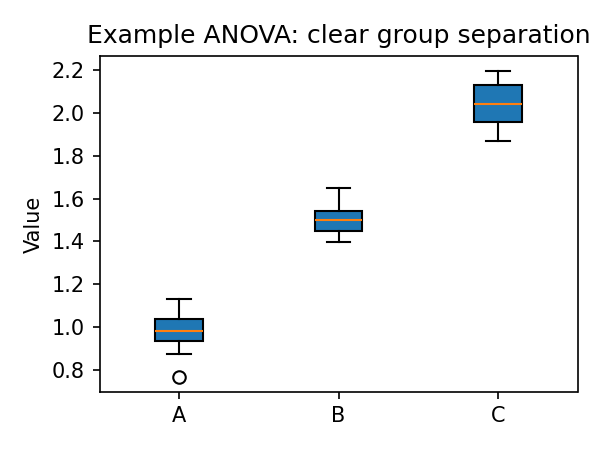

# ANOVA and MANOVA for Food Spectroscopy

ANOVA tests whether group means differ; MANOVA extends this to multiple dependent variables (e.g., multiple peak ratios or PC scores). This chapter details both, with food spectroscopy examples.

## ANOVA basics
- **One-way ANOVA:** Compares means across ≥3 groups.
  - F-statistic: \( F = \frac{SS_\text{between}/(k-1)}{SS_\text{within}/(N-k)} \)
    - \( SS_\text{between} \): sum of squares between groups; \( SS_\text{within} \): within groups; \( k \): groups; \( N \): total samples.
  - Assumptions: normality of residuals, homoscedasticity, independence.
- **Two-way ANOVA (outline):** Two factors (e.g., oil_type and batch) and interaction; requires balanced or at least sufficiently populated cells.

## MANOVA: Multivariate Analysis of Variance
- **What/why:** Multivariate generalization of ANOVA when you have several correlated responses (e.g., multiple ratios or PC scores) and want a single test of group separation. Avoids multiple univariate tests and captures covariance between responses.
- **Model:** Given \(X \in \mathbb{R}^{n \times p}\) (p responses) and groups \(g\), MANOVA tests whether group centroids differ in the p‑dimensional space.
- **Statistics:** Wilks’ lambda (default in FoodSpec) or Pillai’s trace; small values → stronger separation. F-approximations yield p-values.
- **Assumptions:** Multivariate normality, homogeneity of covariance matrices, independence. If doubtful, consider dimension reduction plus nonparametric follow-ups.

### Minimal FoodSpec example
```python
import pandas as pd
from foodspec.stats import run_manova

# df_ratios contains multiple ratio columns and an 'oil_type' column
X = df_ratios[['ratio_1655_1745', 'ratio_3010_2850']]
res = run_manova(X, df_ratios['oil_type'])
print("Wilks lambda:", res.statistic, "p-value:", res.pvalue)
```
Interpretation: small p-value → at least one group differs jointly across the ratios; follow with PCA/loadings or pairwise exploration.

## Post-hoc comparisons
- **Tukey HSD:** Pairwise group comparisons when variances are similar; controls family-wise error using the studentized range distribution.
- **Games–Howell:** Robust to unequal variances and sample sizes; recommended for heterogeneous spectral datasets.

### Tukey HSD usage (equal variances/balanced-ish groups)
```python
from foodspec.stats import run_tukey_hsd
tukey = run_tukey_hsd(df['ratio'], df['oil_type'])
print(tukey.head())
```
Interpretation: adjusted p-values and confidence intervals per pair; “reject=True” indicates a significant pair.

### Games–Howell usage (unequal variances/sizes)
```python
from foodspec.stats import games_howell
tbl = games_howell(df['ratio'], df['oil_type'])
print(tbl[['group1','group2','meandiff','p_adj','reject']])
```
Interpretation: Welch-style pairwise comparisons without assuming equal variances; safer default when heteroscedastic or unbalanced. Reporting example: “Games–Howell showed oil A > oil B (mean diff = …, p_adj = …, 95% CI …).”

## Effect sizes
- Eta-squared \( \eta^2 = SS_\text{between} / SS_\text{total} \).
- Partial eta-squared \( = SS_\text{between} / (SS_\text{between} + SS_\text{within}) \).
- Report alongside p-values to convey magnitude.

## Food spectroscopy examples
- Oil authentication: ANOVA on 1655/1742 ratio across oil types; Tukey to see which pairs differ.
- Heating stages: ANOVA on unsaturation ratio across time bins; partial eta-squared to quantify effect size.
- MANOVA: Multiple ratios or PC scores across microbial strains.



## Code snippets
```python
from foodspec.stats import run_anova, run_tukey_hsd, compute_anova_effect_sizes

# df with columns ratio, oil_type
res = run_anova(df["ratio"], df["oil_type"])
print(res.summary)

# Effect size (requires sums of squares; here approximated)
ss_between = 10.0
ss_total = 20.0
print(compute_anova_effect_sizes(ss_between, ss_total))

# Tukey (if statsmodels installed)
try:
    tukey = run_tukey_hsd(df["ratio"], df["oil_type"])
    print(tukey.head())
except ImportError:
    pass
```

## Decision aid: Is ANOVA appropriate?
```mermaid
flowchart TD
  A[Groups >= 3?] --> B{Normality/homoscedasticity reasonable?}
  B -->|Yes| C[ANOVA → Tukey]
  B -->|No| D{Transform or nonparametric?}
  D -->|Transform| E[Reassess assumptions]
      D -->|Nonparametric| F[Kruskal–Wallis / Games–Howell (see Nonparametric methods)]
```

## Reporting (MethodsX tone)
- State test type (ANOVA/MANOVA), factors, assumptions, effect sizes.
- Provide p-values and post-hoc results; include means/SD per group.
- Visuals: boxplots/mean plots with CIs; Tukey pairwise table/plot.

## Further reading
- [Hypothesis testing](hypothesis_testing_in_food_spectroscopy.md)
- [t-tests, effect sizes, power](t_tests_effect_sizes_and_power.md)
- [Study design](study_design_and_data_requirements.md)
- [Nonparametric methods & robustness](nonparametric_methods_and_robustness.md)
- API: [Statistics](../api/stats.md)
