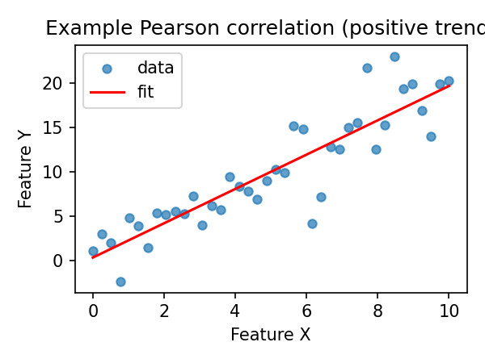
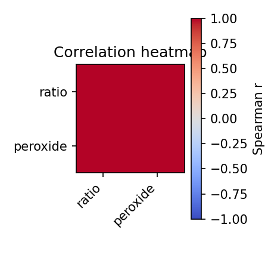
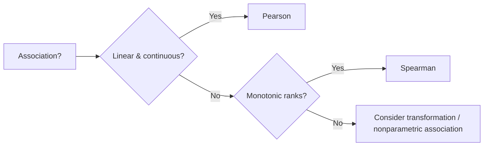

# Correlation and Mapping in Food Spectroscopy

Correlations assess associations between spectral features and quality metrics. Mapping extends this to time/sequence relationships (asynchronous or lagged). This chapter covers Pearson/Spearman correlations and cross-correlation in food spectroscopy contexts.

## Correlation coefficients
- **Pearson (linear):** \( r = \frac{\sum (x_i - \bar{x})(y_i - \bar{y})}{\sqrt{\sum (x_i - \bar{x})^2 \sum (y_i - \bar{y})^2}} \). Assumes approximate linear relationship; sensitive to outliers.
- **Spearman (rank):** Correlates rank-transformed data; robust to monotonic but non-linear relationships.
- **Kendall (optional):** Rank-based; less common here but can be used for ordinal/robust needs.

### When to choose
- Use **Pearson** when data are roughly linear and continuous.
- Use **Spearman** when relationships are monotonic but not linear, or when outliers/ordinal scales are present.

## Synchronous mapping
- Correlate features measured under the same conditions (e.g., 1655/1742 ratio vs peroxide value).
- Useful for cross-validating spectral markers with reference assays (lab chemistry).

## Asynchronous / cross-correlation (time/sequence)
- Cross-correlation explores lagged relationships (e.g., spectral ratio changes lagging behind temperature or time).
- For sequences of equal length, compute correlation at multiple lags to see leading/lagging effects.
- Simple definition for lag \( k \): \( r_k = \sum_t x_t y_{t+k} \) (typically normalized).

## Food spectroscopy examples
- Heating: correlate unsaturation ratio with heating time (Pearson/Spearman); cross-correlate ratio vs temperature ramp to detect lag.
- Fermentation or sequential processing: track spectral markers vs time/quality scores.
- QC: correlate fingerprint similarity scores with batch attributes.

## Code snippets
```python
import pandas as pd
from foodspec.stats import compute_correlations, compute_correlation_matrix, compute_cross_correlation

df = pd.DataFrame({"ratio": [1.0, 1.1, 1.2, 1.3], "peroxide": [2, 4, 6, 8]})
pear = compute_correlations(df, ("ratio", "peroxide"), method="pearson")
print(pear)

mat = compute_correlation_matrix(df, ["ratio", "peroxide"], method="spearman")
print(mat)

xcorr = compute_cross_correlation([1, 2, 3, 4], [1, 2, 3, 4], max_lag=1)
print(xcorr)

# Simple heatmap (matplotlib)
import matplotlib.pyplot as plt
fig, ax = plt.subplots()
im = ax.imshow(mat.values, cmap="coolwarm", vmin=-1, vmax=1)
ax.set_xticks(range(len(mat.columns)))
ax.set_xticklabels(mat.columns, rotation=45, ha="right")
ax.set_yticks(range(len(mat.index)))
ax.set_yticklabels(mat.index)
fig.colorbar(im, ax=ax, label="Spearman r")
fig.tight_layout()
plt.close(fig)
```




## Decision aid: Pearson vs Spearman


## Interpretation
- Report r and p-value; for Spearman, emphasize monotonicity rather than linear slope.
- Use heatmaps for multiple features; annotate significant associations cautiously to avoid over-interpretation.

## Further reading
- [Hypothesis testing](hypothesis_testing_in_food_spectroscopy.md)
- [Study design](study_design_and_data_requirements.md)
- API: [Statistics](../api/stats.md)
