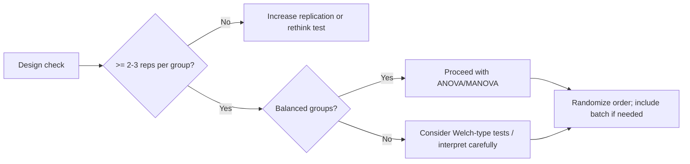

# Study Design and Data Requirements

Good statistical practice starts with good design. This chapter summarizes replication, balance, randomization, and instrument considerations for food spectroscopy, and how these affect power and assumptions.

## Replication and sample size
- Multiple spectra per sample and per group capture variability (sample prep, instrument noise).
- More replicates → lower standard error → higher power. Aim for at least a few replicates per group for ANOVA/t-tests.
- Avoid pseudo-replication: repeated scans of one aliquot are not independent biological replicates.

## Balance vs unbalance
- **Balanced designs** (similar n per group) improve ANOVA robustness and power.
- **Unbalanced designs** can inflate Type I error or reduce power; use Welch-type tests or carefully interpret ANOVA.

## Randomization and blocking
- Randomize acquisition order to reduce drift/systematic bias.
- Block by batch/instrument if relevant; include batch as a factor in analysis when possible.

## Instrument considerations
- Calibration and drift: frequent calibration reduces variance; monitor drift over time.
- Noise: higher noise reduces power; invest in preprocessing (baseline, smoothing, normalization) to stabilize variance.
- Alignment: ensure wavenumbers are aligned across runs; misalignment can inflate variance and violate assumptions.

## Data quality and preprocessing consistency
- Use consistent preprocessing across all groups (baseline, normalization, cropping).
- Document instrument settings, laser wavelength, ATR crystal, etc., as they influence comparability.

## Design suitability for ANOVA/MANOVA

## Reporting
- State group sizes, replication scheme, randomization/blocking, and any exclusions.
- Note instrument model/settings and preprocessing applied.
- Tie design choices to assumptions (normality, homoscedasticity) and power considerations.

## Further reading
- [Hypothesis testing](hypothesis_testing_in_food_spectroscopy.md)
- [ANOVA and MANOVA](anova_and_manova.md)
- [Reproducibility checklist](../protocols/reproducibility_checklist.md)
