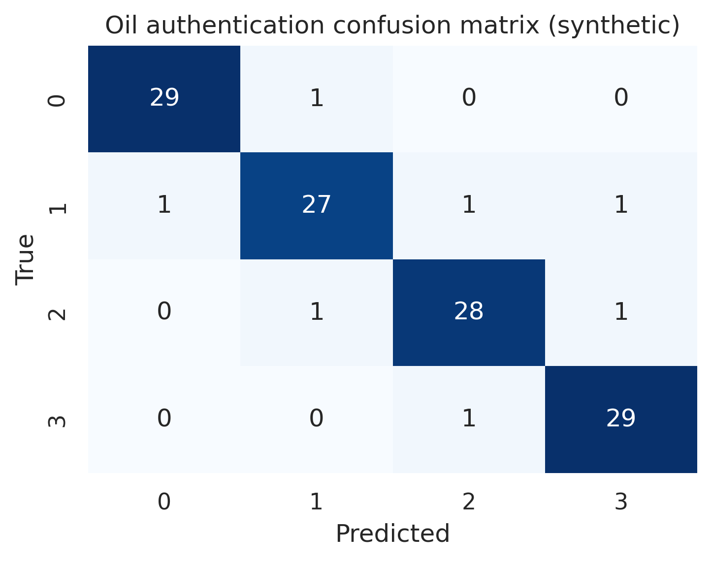
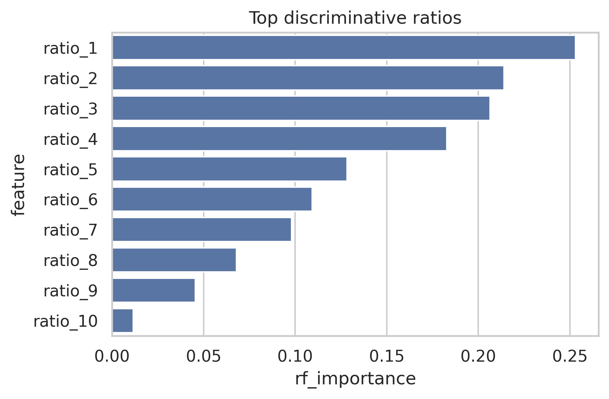
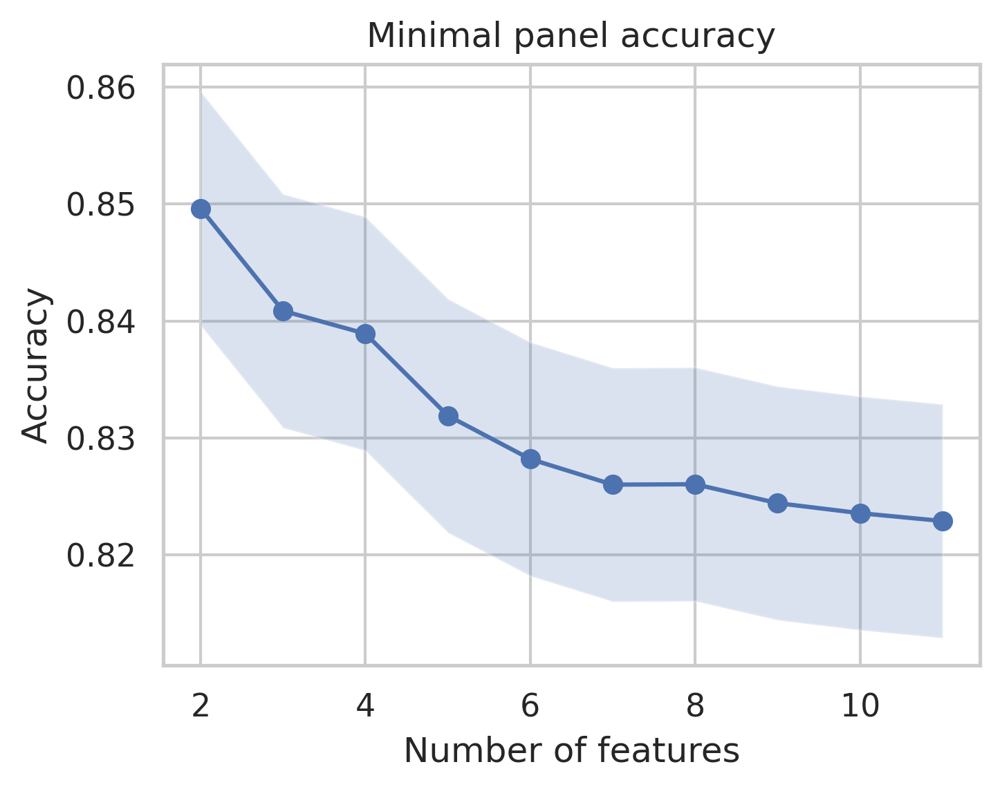
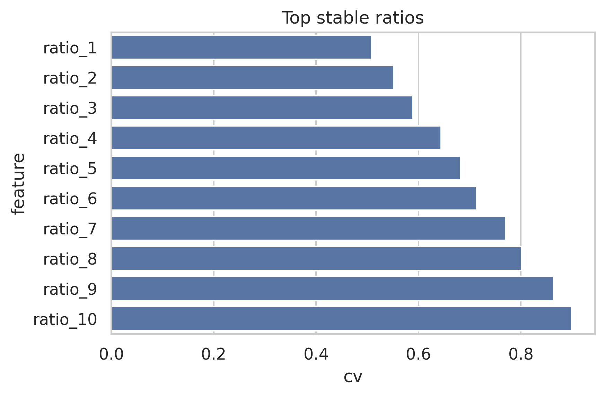

# Tutorial: Oil Authentication

**Purpose:** Authenticate edible oils (Raman/FTIR) using ratiometric features and validation.

**Audience:** Food scientists, QA engineers, chemometricians.

**Time:** 30–45 minutes.

**Prerequisites:** FoodSpec installed, CSV or HDF5 data with oil types and spectra.

---

## Overview

This tutorial demonstrates how to authenticate edible oils using vibrational spectroscopy. You will:

- Load spectral data (CSV or HDF5) with oil labels
- Apply preprocessing (baseline correction, normalization)
- Extract ratiometric features (e.g., C=O/C=C band ratios)
- Train and validate a classifier with nested cross-validation
- Generate publication-ready figures and metrics

**Example data:** `examples/data/oils.csv` (Raman spectra, oil types, batch info)  
**Protocol:** `examples/protocols/oil_basic.yaml` (baseline ALS, SNV normalization, Random Forest)

## Why it matters (theory)
Authenticating oils protects against adulteration and ensures quality. Discriminative ratios (e.g., carbonyl/unsaturation bands) separate oil types. Validation (batch-aware CV) checks generalization; see [rq_engine_theory.md](../../theory/rq_engine_detailed.md) and [chemometrics_and_ml_basics.md](../../theory/chemometrics_and_ml_basics.md).

<!-- GUI workflow removed; use CLI workflow below -->

## CLI workflow
```bash
foodspec-run-protocol \
  --input examples/data/oils.csv \
  --protocol examples/protocols/oil_basic.yaml \
  --output-dir runs/oil_basic_tutorial

foodspec-publish runs/oil_basic_tutorial/<timestamp> --fig-limit 6
```
Check `figures/` for confusion matrix and discriminative barplots; `tables/` for discriminative and minimal panel summaries.

## Example figures (from run bundle)





## How to read the results
- **Confusion matrix/balanced accuracy:** off-diagonals show misclassifications; balanced accuracy corrects imbalance.  
- **Discriminative ratios/effect sizes:** look for high importance or low FDR-corrected p-values.  
- **Minimal marker panel:** smallest feature set meeting target accuracy—useful for QA panels.  
- **Stability (CV/MAD):** lower CV/MAD indicates more reproducible markers.

## Cross-links
- Cookbook recipes: [cookbook_rq_questions.md](../../theory/rq_engine_detailed.md)  
- Theory: [rq_engine_theory.md](../../theory/rq_engine_detailed.md)
