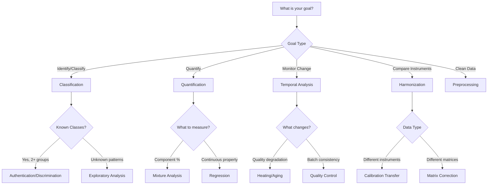

# Decision Guide: Choosing the Right Approach

**Purpose:** Navigate FoodSpec's methods, workflows, and APIs based on your research goals.

This guide helps you choose the appropriate analysis path by asking: *"What am I trying to do?"* Each decision leads to specific methods, working examples, and API references.

---

## 🎯 Quick Decision Tree



---

## 🔍 Goal-Based Navigation

### 1. Classification & Discrimination

#### 1.1 Authenticate or Detect Adulteration

**When:** You need to distinguish genuine samples from adulterants or identify product origin.

**Decision factors:**
- **Small dataset (<100 samples):** Use PLS-DA with cross-validation
- **Large dataset (>1000 samples):** Consider deep learning or ensemble methods
- **Interpretability required:** Use ratio-based features or VIP scores
- **Black-box acceptable:** Neural networks or random forests

**Matrix considerations:**
- **Pure oils:** Standard preprocessing → classification
- **Complex matrices (chips, meat):** Add scatter correction + MSC normalization

**→ Method:** [Classification & Regression](../methods/chemometrics/classification_regression.md)  
**→ Example:** [Oil Authentication](../examples/01_oil_authentication.md)  
**→ API:** [ML & Validation](../api/ml.md)

**Typical workflow:**
```python
from foodspec import FoodSpec

# Load and preprocess
fs = FoodSpec.from_csv("oils.csv", modality="raman")
fs = fs.baseline_als().normalize_snv()

# Classify
result = fs.classify(
    label_column="oil_type",
    model="pls-da",
    cv_folds=5
)
print(f"Accuracy: {result.accuracy:.1%}")
```

---

#### 1.2 Exploratory Analysis (Unknown Groupings)

**When:** You suspect patterns but don't have labels, or want to discover subgroups.

**Decision factors:**
- **Dimensionality reduction first:** Always start with PCA
- **Cluster hypothesis testing:** Use PERMANOVA or ANOSIM
- **Outlier detection:** Check before clustering

**→ Method:** [PCA & Dimensionality Reduction](../methods/chemometrics/pca_and_dimensionality_reduction.md)  
**→ Example:** [Exploratory PCA in Examples](../examples_gallery.md)  
**→ API:** [Chemometrics](../api/chemometrics.md)

**Typical workflow:**
```python
from foodspec.chemometrics import run_pca

# Run PCA
pca_result = run_pca(
    X=fs.x,
    n_components=5,
    scale=True
)

# Visualize
pca_result.plot_scores(
    labels=fs.metadata["batch"],
    title="Batch Clustering"
)
```

---

### 2. Quantification

#### 2.1 Mixture Analysis (Component Percentages)

**When:** Estimate % composition of known components in mixtures.

**Decision factors:**
- **Known pure references available:** Use MCR-ALS or NNLS
- **No pure references:** Use PLS regression with calibration set
- **2-3 components:** Direct peak ratios may suffice
- **4+ components:** Multivariate methods required

**→ Method:** [Mixture Models](../methods/chemometrics/mixture_models.md)  
**→ Example:** [Mixture Analysis](../examples/03_mixture_analysis.md)  
**→ API:** [Chemometrics - Mixture Analysis](../api/chemometrics.md)

**Typical workflow:**
```python
from foodspec.chemometrics import mcr_als

# MCR-ALS for 3-component mixture
result = mcr_als(
    X=mixture_spectra,
    n_components=3,
    initial_guess=pure_spectra,
    max_iter=100
)

# Get concentrations
concentrations = result.C  # Sample × component
```

---

#### 2.2 Regression (Continuous Properties)

**When:** Predict continuous values (moisture %, protein content, peroxide value).

**Decision factors:**
- **Linear relationship expected:** PLS regression
- **Nonlinear relationships:** Random forest, neural networks
- **Small calibration set (<50):** PLS with careful validation
- **Large calibration set (>200):** More complex models feasible

**→ Method:** [Classification & Regression](../methods/chemometrics/classification_regression.md)  
**→ Example:** [Calibration Example](../workflows/quantification/calibration_regression_example.md)  
**→ API:** [ML & Validation](../api/ml.md)

**Typical workflow:**
```python
from foodspec.ml import nested_cross_validate

# PLS regression with nested CV
results = nested_cross_validate(
    X=fs.x,
    y=fs.metadata["moisture_percent"],
    model="pls",
    cv_folds=5,
    n_components_range=[1, 2, 3, 5, 10]
)
print(f"R² = {results['r2']:.3f}, RMSE = {results['rmse']:.2f}")
```

---

### 3. Temporal Analysis & Monitoring

#### 3.1 Heating & Degradation Monitoring

**When:** Track quality changes over time (oxidation, thermal degradation, shelf life).

**Decision factors:**
- **Known degradation markers:** Track specific peak ratios over time
- **Unknown mechanisms:** Use multivariate time-series analysis
- **Predict shelf life:** Fit degradation models to ratio trajectories

**→ Method:** [Statistical Analysis](../methods/statistics/introduction_to_statistical_analysis.md)  
**→ Example:** [Heating Quality Monitoring](../examples/02_heating_quality_monitoring.md)  
**→ API:** [Workflows](../api/workflows.md)

**Typical workflow:**
```python
from foodspec.workflows import analyze_heating_trajectory

# Analyze time series
result = analyze_heating_trajectory(
    spectra=fs,
    time_column="heating_time_min",
    ratio_numerator=1655,  # C=C unsaturation
    ratio_denominator=1440  # CH2 reference
)

# Get shelf life estimate
shelf_life = result.estimate_shelf_life(threshold=0.8)
print(f"Estimated shelf life: {shelf_life} hours")
```

---

#### 3.2 Batch Quality Control

**When:** Monitor production batches for consistency and drift detection.

**Decision factors:**
- **Continuous monitoring:** Control charts with Hotelling's T²
- **Batch comparison:** ANOVA or Kruskal-Wallis tests
- **Outlier detection:** Mahalanobis distance or PCA residuals
- **Small batch sizes (<10):** Use robust statistics

**→ Method:** [Statistical Study Design](../methods/statistics/study_design_and_data_requirements.md)  
**→ Example:** [Batch QC Workflow](../workflows/quality-monitoring/batch_quality_control.md)  
**→ API:** [Statistics](../api/stats.md)

**Typical workflow:**
```python
from foodspec.qc import check_class_balance, detect_outliers

# Check batch consistency
balance = check_class_balance(fs.metadata, "batch_id")
outliers = detect_outliers(
    fs.x,
    method="mahalanobis",
    threshold=3.0
)

# Statistical comparison
from foodspec.stats import run_anova
anova_result = run_anova(
    fs.x[:, peak_idx],  # Specific peak
    groups=fs.metadata["batch_id"]
)
```

---

### 4. Harmonization & Instrument Comparability

#### 4.1 Different Instruments (Same Sample Type)

**When:** Combine data from multiple Raman or FTIR instruments measuring the same samples.

**Decision factors:**
- **Standards available:** Piecewise Direct Standardization (PDS)
- **No standards, overlapping samples:** Direct Standardization (DS)
- **Completely different wavelength ranges:** May not be harmonizable

**→ Method:** [Harmonization Theory](../theory/harmonization_theory.md)  
**→ Example:** [Multi-Instrument Workflow](../workflows/harmonization/harmonization_automated_calibration.md)  
**→ API:** [Calibration Transfer](../api/workflows.md)

**Typical workflow:**
```python
from foodspec.calibration_transfer import piecewise_direct_standardization

# Transfer from instrument A to B
transfer = piecewise_direct_standardization(
    X_source=spectra_instrument_A,
    X_target=spectra_instrument_B,
    window_size=11
)

# Apply to new measurements
X_harmonized = transfer.transform(X_new_from_A)
```

---

#### 4.2 Different Matrices (Same Measurement Goal)

**When:** Compare oils in pure form vs. oils extracted from fried chips, or milk vs. cheese.

**Decision factors:**
- **Known matrix effects:** Apply matrix-specific corrections first
- **Unknown effects:** Domain adaptation or transfer learning
- **Small target matrix data:** Use source matrix model with caution

**→ Method:** [Matrix Effects](../methods/preprocessing/scatter_correction_cosmic_ray_removal.md)  
**→ Example:** [Matrix Correction](../workflows/harmonization/standard_templates.md)  
**→ API:** [Workflows - Matrix Correction](../api/workflows.md)

**Typical workflow:**
```python
from foodspec.matrix_correction import apply_matrix_correction

# Correct for matrix effects
corrected = apply_matrix_correction(
    X_target=chips_spectra,
    X_reference=oil_spectra,
    method="msc"
)
```

---

### 5. Preprocessing & Data Cleaning

#### 5.1 Which Preprocessing Steps Do I Need?

**Decision factors by symptom:**

| **Symptom** | **Solution** | **Method** | **API** |
|-------------|--------------|------------|---------|
| Curved baselines, fluorescence | Baseline correction | [Baseline Correction](../methods/preprocessing/baseline_correction.md) | [baseline_als](../api/preprocessing.md) |
| Different intensities, scaling issues | Normalization | [Normalization](../methods/preprocessing/normalization_smoothing.md) | [normalize_snv](../api/preprocessing.md) |
| Noisy spectra, hard to see peaks | Smoothing | [Smoothing](../methods/preprocessing/normalization_smoothing.md) | [savgol_smooth](../api/preprocessing.md) |
| Cosmic ray spikes (Raman) | Spike removal | [Cosmic Rays](../methods/preprocessing/scatter_correction_cosmic_ray_removal.md) | [CosmicRayRemover](../api/preprocessing.md) |
| Overlapping peaks | Derivatives (1st/2nd) | [Derivatives](../methods/preprocessing/derivatives_and_feature_enhancement.md) | [savgol_smooth](../api/preprocessing.md) |
| Scatter effects, particle size | MSC/SNV | [Scatter Correction](../methods/preprocessing/scatter_correction_cosmic_ray_removal.md) | [MSCNormalizer](../api/preprocessing.md) |

**Recommended preprocessing order:**
1. **Cosmic ray removal** (if Raman)
2. **Baseline correction** (if curved backgrounds)
3. **Smoothing** (if noisy)
4. **Normalization** (SNV or MSC)
5. **Derivatives** (optional, for overlapping peaks)
6. **Feature extraction** or **full-spectrum modeling**

**→ Full Guide:** [Preprocessing Methods Overview](../methods/index.md#preprocessing)

---

## 📊 Dataset Size & Complexity Guide

### Small Datasets (<100 samples)

**Challenges:** Limited statistical power, risk of overfitting.

**Recommended approaches:**
- **Preprocessing:** Conservative (avoid over-smoothing)
- **Feature selection:** Use a priori knowledge (literature-based peaks)
- **Validation:** Leave-one-out CV or stratified 5-fold CV
- **Models:** Simple models (PLS-DA, linear regression)
- **Avoid:** Deep learning, complex ensemble methods

**→ Guide:** [Study Design - Sample Size](../methods/statistics/study_design_and_data_requirements.md)

---

### Medium Datasets (100-1000 samples)

**Opportunities:** Moderate statistical power, can test multiple methods.

**Recommended approaches:**
- **Preprocessing:** Standard pipelines
- **Feature selection:** Data-driven + domain knowledge hybrid
- **Validation:** Nested cross-validation with holdout test set
- **Models:** PLS, random forests, gradient boosting
- **Hyperparameter tuning:** Grid search feasible

**→ Guide:** [Cross-Validation Best Practices](../methods/validation/cross_validation_and_leakage.md)

---

### Large Datasets (>1000 samples)

**Opportunities:** High statistical power, can use complex models.

**Recommended approaches:**
- **Preprocessing:** Automated pipelines acceptable
- **Feature selection:** Automatic feature importance ranking
- **Validation:** Train/validation/test splits
- **Models:** Neural networks, deep learning, ensembles
- **Advanced techniques:** Transfer learning, multi-task learning

**→ Guide:** [Advanced Deep Learning](../methods/chemometrics/advanced_deep_learning.md)

---

## 🧪 Sample Matrix Guide

### Pure Liquids (Oils, Solvents)

**Characteristics:** Minimal scatter, good optical contact.

**Preprocessing:**
- Baseline: Mild (ALS with conservative parameters)
- Normalization: Vector or area normalization
- Scatter correction: Usually not needed

**→ Example:** [Oil Authentication](../examples/01_oil_authentication.md)

---

### Powders & Solids (Flour, Spices)

**Characteristics:** High scatter from particle size variations.

**Preprocessing:**
- Baseline: Aggressive (ALS or rubberband)
- Normalization: **SNV or MSC** (critical)
- Scatter correction: Essential

**→ Method:** [Scatter Correction](../methods/preprocessing/scatter_correction_cosmic_ray_removal.md)

---

### Emulsions & Suspensions (Milk, Juices)

**Characteristics:** Complex scatter, heterogeneous.

**Preprocessing:**
- Baseline: Moderate
- Normalization: MSC with robust mean
- Homogenization: May need sample prep guidance

---

### Tissue & Meat Products

**Characteristics:** Variable water content, complex matrix.

**Preprocessing:**
- Baseline: Essential
- Normalization: SNV recommended
- Water bands: May need masking (1640 cm⁻¹, 3200-3600 cm⁻¹)

---

## 🔗 Cross-Reference Table

| **Goal** | **Method Page** | **Example** | **API** |
|----------|----------------|-------------|---------|
| Oil authentication | [Classification](../methods/chemometrics/classification_regression.md) | [Oil Example](../examples/01_oil_authentication.md) | [ML API](../api/ml.md) |
| Heating monitoring | [Statistics](../methods/statistics/introduction_to_statistical_analysis.md) | [Heating Example](../examples/02_heating_quality_monitoring.md) | [Workflows API](../api/workflows.md) |
| Mixture quantification | [Mixture Models](../methods/chemometrics/mixture_models.md) | [Mixture Example](../examples/03_mixture_analysis.md) | [Chemometrics API](../api/chemometrics.md) |
| Hyperspectral mapping | [Spatial Analysis](../workflows/spatial/hyperspectral_mapping.md) | [HSI Example](../examples/04_hyperspectral_mapping.md) | [Datasets API](../api/datasets.md) |
| Baseline correction | [Baseline Methods](../methods/preprocessing/baseline_correction.md) | [Recipe Card #2](../examples_gallery.md) | [Preprocessing API](../api/preprocessing.md) |
| PCA exploration | [PCA Guide](../methods/chemometrics/pca_and_dimensionality_reduction.md) | [PCA Examples](../examples_gallery.md) | [Chemometrics API](../api/chemometrics.md) |
| Batch QC | [Study Design](../methods/statistics/study_design_and_data_requirements.md) | [QC Workflow](../workflows/quality-monitoring/batch_quality_control.md) | [Statistics API](../api/stats.md) |
| Multi-instrument | [Harmonization](../theory/harmonization_theory.md) | [Harmonization Workflow](../workflows/harmonization/harmonization_automated_calibration.md) | [Workflows API](../api/workflows.md) |

---

## 🧭 Still Not Sure?

**If you're uncertain which approach to use:**

1. **Start simple:** Run PCA on preprocessed data to visualize structure
2. **Check assumptions:** Read [Study Design](../methods/statistics/study_design_and_data_requirements.md) for sample size guidance
3. **Try examples:** Run closest [teaching example](../examples/index.md) with your data
4. **Ask for help:** See [FAQ](../help/faq.md) or [community discussions](https://github.com/chandrasekarnarayana/foodspec/discussions)

**Common pitfalls to avoid:**
- ❌ Applying complex models to small datasets
- ❌ Skipping preprocessing for raw spectra
- ❌ Not validating results properly (train/test leakage)
- ❌ Ignoring matrix effects in heterogeneous samples

**Best practices:**
- ✅ Start with visualization (PCA, score plots)
- ✅ Use domain knowledge for feature selection
- ✅ Validate rigorously (nested CV or holdout test)
- ✅ Document preprocessing decisions
- ✅ Report uncertainty (confidence intervals, p-values)

---

## 📚 Further Reading

- **For method details:** [Methods Overview](../methods/index.md)
- **For worked examples:** [Examples Gallery](../examples_gallery.md)
- **For API documentation:** [API Reference](../api/index.md)
- **For theory:** [Spectroscopy Basics](../theory/spectroscopy_basics.md)
- **For troubleshooting:** [Common Problems](../help/common_problems.md)
