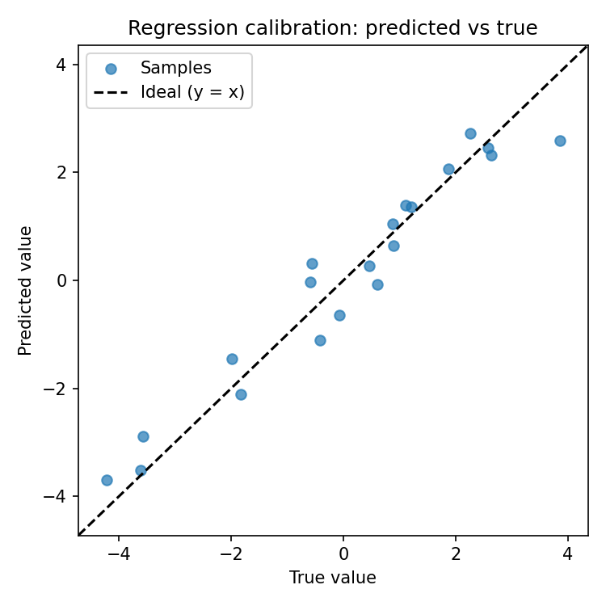

# Calibration / Regression Example

Predicting a continuous quality index (e.g., mixture fraction or degradation score) from spectral features is a common task. This example shows a simple pipeline using synthetic data to illustrate calibration, metrics, and robustness checks.

> For model and metric choices, see [ML & DL models](../ml/models_and_best_practices.md) and [Metrics & evaluation](../metrics/metrics_and_evaluation.md).

## Scientific question
- Can spectral ratios or latent variables (PLS components) predict a continuous quality metric?
- How stable is the calibration (predicted vs true), and what is the uncertainty of the metrics?

## Data and setup
- Synthetic spectral features are used here for illustration; replace with real ratios/PCs in practice.
- Preprocessing would normally precede this step (baseline, smoothing, normalization).

## Code example (PLS regression + metrics + robustness)
```python
import numpy as np
from foodspec.chemometrics.models import make_pls_regression
from foodspec.chemometrics.validation import compute_regression_metrics
from foodspec.stats import bootstrap_metric, permutation_test_metric

rng = np.random.default_rng(42)
n_samples, n_features = 120, 15
X = rng.normal(0, 1, size=(n_samples, n_features))
true_coefs = rng.normal(0.4, 0.2, size=n_features)
y = X @ true_coefs + rng.normal(0, 0.4, size=n_samples)

model = make_pls_regression(n_components=5)
model.fit(X, y)
y_pred = model.predict(X).ravel()

metrics = compute_regression_metrics(y, y_pred)
print(metrics)  # RMSE, MAE, R^2

# Optional: MLP regression if non-linear bias persists
from foodspec.chemometrics.models import make_mlp_regressor

mlp = make_mlp_regressor(hidden_layer_sizes=(64, 32), max_iter=400, random_state=0)
mlp.fit(X, y)
y_pred_mlp = mlp.predict(X)
mlp_metrics = compute_regression_metrics(y, y_pred_mlp)
print("MLP metrics:", mlp_metrics)

def rmse(a, b):
    return np.sqrt(np.mean((a - b) ** 2))

boot = bootstrap_metric(rmse, y, y_pred, n_bootstrap=500, random_state=0)
perm = permutation_test_metric(rmse, y, y_pred, n_permutations=500, metric_higher_is_better=False, random_state=0)
print("Bootstrap CI:", boot["ci"], "Permutation p-value:", perm["p_value"])
```



*Figure: Predicted vs true values for a PLS regression on synthetic data. Points close to the diagonal indicate good calibration; systematic deviation signals bias. Generated via `docs/examples/ml/generate_regression_calibration_figure.py`.*

Optionally add uncertainty/agreements (DL optional—use only with sufficient data and always benchmark against PLS/linear baselines):

```python
from foodspec.viz import plot_calibration_with_ci, plot_bland_altman

ax = plot_calibration_with_ci(y_true, y_pred)
ax.figure.savefig("calibration_ci.png", dpi=150)
ax = plot_bland_altman(y_true, y_pred)
ax.figure.savefig("bland_altman.png", dpi=150)
```

## Reporting
- Report RMSE/MAE/R² with confidence intervals (bootstrap) and, if needed, permutation p-values for chance-level checks.
- Include predicted-vs-true plots and residual diagnostics for transparency.
- Note preprocessing steps, feature choices (ratios/PCs), model settings (components), and validation design.

### Qualitative & quantitative interpretation
- **Qualitative:** Predicted vs true should cluster around the 1:1 line; residuals should be structureless and homoscedastic.
- **Quantitative:** Report RMSE/MAE/R² (and adjusted R² if multiple predictors); consider bootstrap CIs and permutation checks for small n. Add CI bands on calibration plots (`plot_calibration_with_ci`) and, when comparing methods, use Bland–Altman to assess agreement (bias, limits). Link to [Metrics & evaluation](../metrics/metrics_and_evaluation.md) and [Hypothesis testing](../stats/hypothesis_testing_in_food_spectroscopy.md) for supporting stats.
- **Reviewer phrasing:** “Calibration achieved R² = … and RMSE = …; residuals show no trend with fitted values, suggesting adequate model form.”

## See also
- [Classification & regression](../ml/classification_regression.md)
- [Metrics & evaluation](../metrics/metrics_and_evaluation.md)
- [Workflow design](workflow_design_and_reporting.md)
- [Stats: nonparametric & robustness](../stats/nonparametric_methods_and_robustness.md)
