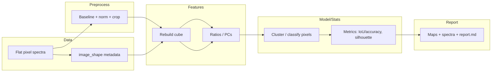

# Workflow: Hyperspectral Mapping

## 📋 Standard Header

**Purpose:** Spatially resolve composition, contaminants, or quality gradients in hyperspectral images by treating each pixel as a spectrum.

**When to Use:**
- Detect spatial adulteration or contamination patterns
- Map tissue structure or component distribution in samples
- Identify localized defects or quality gradients
- Visualize heterogeneity across product surfaces
- Validate spatial uniformity in blends or mixtures

**Inputs:**
- Format: Per-pixel spectra flattened to rows in HDF5 or CSV
- Required metadata: `image_shape` (height, width) for cube reconstruction
- Optional metadata: `pixel_x`, `pixel_y`, `label_mask` (if ground truth available)
- Wavenumber range: Typically 600–1800 cm⁻¹ (same as other workflows)
- Min samples: 1000+ pixels (typical small image 30×30; large images 100×100+)

**Outputs:**
- intensity_map.png — Single-wavenumber intensity map (e.g., 1655 cm⁻¹)
- ratio_map.png — Spatial map of key ratio (e.g., 1655/1742)
- cluster_map.png — Pixel segmentation via k-means or classification
- pixel_spectra.png — Representative spectra from each cluster/region
- metrics.json — IoU, pixel-wise accuracy (if labeled), silhouette coefficient
- report.md — Interpretation of spatial patterns

**Assumptions:**
- Each pixel's spectrum independent (no spatial autocorrelation assumed in model)
- Image_shape metadata correct (mismatch produces distorted maps)
- SNR adequate for pixel-level analysis (low SNR requires spatial smoothing)
- Registration accurate (no misalignment between wavelengths)

---

## 🔬 Minimal Reproducible Example (MRE)

```python
import numpy as np
import matplotlib.pyplot as plt
from foodspec.core.hyperspectral import HyperSpectralCube
from foodspec.viz.hyperspectral import plot_hyperspectral_intensity_map, plot_hyperspectral_ratio_map
from foodspec.chemometrics.clustering import cluster_pixels
from foodspec.viz.clustering import plot_cluster_map

# Generate synthetic hyperspectral data (30x30 pixels)
def generate_synthetic_hsi(image_shape=(30, 30), n_wavenumbers=200, random_state=42):
    """Create synthetic hyperspectral cube with two regions."""
    np.random.seed(random_state)
    h, w = image_shape
    n_pixels = h * w
    wavenumbers = np.linspace(600, 1800, n_wavenumbers)
    
    # Create two regions: left half (component A), right half (component B)
    spectra = []
    labels = []
    
    for i in range(h):
        for j in range(w):
            if j < w // 2:  # Left region
                spectrum = 1.8 * np.exp(-((wavenumbers - 1655) ** 2) / 2000) + \
                           1.2 * np.exp(-((wavenumbers - 1450) ** 2) / 1500)
                label = 'Region_A'
            else:  # Right region
                spectrum = 1.0 * np.exp(-((wavenumbers - 1655) ** 2) / 2000) + \
                           1.8 * np.exp(-((wavenumbers - 1742) ** 2) / 1800)
                label = 'Region_B'
            
            spectrum += np.random.normal(0, 0.05, n_wavenumbers)
            spectra.append(spectrum)
            labels.append(label)
    
    from foodspec import SpectralDataset
    import pandas as pd
    
    df = pd.DataFrame(
        np.array(spectra),
        columns=[f"{w:.1f}" for w in wavenumbers]
    )
    df.insert(0, 'pixel_id', range(n_pixels))
    df.insert(1, 'region', labels)
    
    fs = SpectralDataset.from_dataframe(
        df,
        metadata_columns=['pixel_id', 'region'],
        intensity_columns=[f"{w:.1f}" for w in wavenumbers],
        wavenumber=wavenumbers
    )
    
    return fs, image_shape

# Generate data
fs_pixels, img_shape = generate_synthetic_hsi(image_shape=(30, 30))
print(f"Pixels: {fs_pixels.x.shape[0]} spectra")
print(f"Image shape: {img_shape}")

# Reconstruct hyperspectral cube
cube = HyperSpectralCube.from_spectrum_set(fs_pixels, image_shape=img_shape)
print(f"Cube shape: {cube.data.shape} (height × width × wavelengths)")

# Plot intensity map at key wavenumber
fig1, ax1 = plt.subplots(figsize=(8, 6))
plot_hyperspectral_intensity_map(
    cube,
    target_wavenumber=1655,
    window=5,
    ax=ax1
)
ax1.set_title("Intensity Map at 1655 cm⁻¹ (C=C stretch)")
plt.tight_layout()
plt.savefig("hsi_intensity_map.png", dpi=150, bbox_inches='tight')
print("Saved: hsi_intensity_map.png")

# Calculate and plot ratio map (1655/1742)
fig2, ax2 = plt.subplots(figsize=(8, 6))
plot_hyperspectral_ratio_map(
    cube,
    numerator_wavenumber=1655,
    denominator_wavenumber=1742,
    window=5,
    ax=ax2
)
ax2.set_title("Ratio Map: 1655/1742 (unsaturation/carbonyl)")
plt.tight_layout()
plt.savefig("hsi_ratio_map.png", dpi=150, bbox_inches='tight')
print("Saved: hsi_ratio_map.png")

# Cluster pixels (k-means)
cluster_labels, cluster_centers = cluster_pixels(
    fs_pixels.x,
    n_clusters=2,
    method='kmeans'
)

# Plot cluster map
fig3, ax3 = plt.subplots(figsize=(8, 6))
cluster_map = cluster_labels.reshape(img_shape)
plot_cluster_map(cluster_map, ax=ax3)
ax3.set_title("Pixel Clustering (k=2)")
plt.tight_layout()
plt.savefig("hsi_cluster_map.png", dpi=150, bbox_inches='tight')
print("Saved: hsi_cluster_map.png")

# If ground truth labels available, compute metrics
if 'region' in fs_pixels.metadata.columns:
    from sklearn.metrics import adjusted_rand_score, silhouette_score
    true_labels_numeric = (fs_pixels.metadata['region'] == 'Region_B').astype(int)
    ari = adjusted_rand_score(true_labels_numeric, cluster_labels)
    sil = silhouette_score(fs_pixels.x, cluster_labels)
    print(f"\nClustering Metrics:")
    print(f"  Adjusted Rand Index: {ari:.3f}")
    print(f"  Silhouette Score: {sil:.3f}")
```

**Expected Output:**
```mermaid
Pixels: 900 spectra
Image shape: (30, 30)
Cube shape: (30, 30, 200) (height × width × wavelengths)

Saved: hsi_intensity_map.png
Saved: hsi_ratio_map.png
Saved: hsi_cluster_map.png

Clustering Metrics:
  Adjusted Rand Index: 0.987
  Silhouette Score: 0.652
```

---

## ✅ Validation & Sanity Checks

### Success Indicators

**Intensity/Ratio Maps:**
- ✅ Clear spatial patterns visible (not uniform noise)
- ✅ Boundaries between regions sharp and contiguous
- ✅ Peak intensities match expected chemical composition

**Cluster Map:**
- ✅ Clusters correspond to known sample regions
- ✅ Minimal salt-and-pepper noise (isolated pixels)
- ✅ Cluster boundaries align with visual sample features

**Metrics (if labels available):**
- ✅ Pixel-wise accuracy > 85%
- ✅ IoU > 0.75 (intersection over union for segmentation)
- ✅ Adjusted Rand Index > 0.70 (clustering agreement)
- ✅ Silhouette score > 0.40 (cluster separation)

### Failure Indicators

**⚠️ Warning Signs:**

1. **Salt-and-pepper noise dominates cluster map**
   - Problem: Low SNR; pixel-level classification unstable
   - Fix: Apply spatial smoothing (Gaussian filter); increase cluster size; use superpixels

2. **Ratio map shows stripes or banding artifacts**
   - Problem: Baseline shifts across scan lines; detector non-uniformity
   - Fix: Apply per-line baseline correction; flat-field correction; check instrument calibration

3. **Cluster boundaries don't match sample features**
   - Problem: Wrong number of clusters; features not discriminative; registration errors
   - Fix: Try different k values; use different ratio/PCA features; verify image registration

4. **Intensity map uniform (no structure visible)**
   - Problem: Chosen wavenumber not informative; sample truly homogeneous; SNR too low
   - Fix: Try multiple wavenumbers; check sample preparation; increase integration time

5. **Silhouette score < 0.20**
   - Problem: Clusters poorly separated; too many clusters; features not discriminative
   - Fix: Reduce k; use PCA for dimensionality reduction; try different features

### Quality Thresholds

| Metric | Minimum | Good | Excellent |
|--------|---------|------|--------|
| Pixel-wise Accuracy (if labels) | 75% | 88% | 95% |
| IoU (segmentation) | 0.60 | 0.80 | 0.90 |
| Adjusted Rand Index | 0.50 | 0.75 | 0.90 |
| Silhouette Score | 0.25 | 0.45 | 0.65 |
| SNR (per pixel) | 10 | 25 | 50 |

---

## ⚙️ Parameters You Must Justify

### Critical Parameters

**1. Image Shape**
- **Parameter:** `image_shape` (height, width)
- **Critical:** Must match actual acquisition dimensions
- **Justification:** "Hyperspectral cube reconstructed with image_shape=(30, 30) matching instrument scan settings."

**2. Target Wavenumbers for Mapping**
- **Parameter:** Specific wavenumbers for intensity/ratio maps
- **Default:** 1655 cm⁻¹ (C=C), 1742 cm⁻¹ (C=O)
- **Justification:** "Intensity map at 1655 cm⁻¹ visualizes unsaturation distribution; ratio 1655/1742 quantifies oxidation gradient."

**3. Number of Clusters**
- **Parameter:** `n_clusters` (for k-means)
- **No default:** Must specify based on prior knowledge
- **Justification:** "Two clusters chosen based on known binary composition (authentic/adulterated regions)."

**4. Spatial Smoothing**
- **Parameter:** Gaussian filter sigma (if applied)
- **Default:** None (pixel-level analysis)
- **When to adjust:** Use sigma=1-2 pixels if SNR low
- **Justification:** "No spatial smoothing applied to preserve fine-scale features; SNR adequate for pixel-level classification."

**5. Clustering Method**
- **Parameter:** `method` ('kmeans', 'hierarchical', 'gmm')
- **Default:** 'kmeans'
- **Justification:** "k-means clustering used for computational efficiency on 900-pixel image."

---



## What? / Why? / When? / Where?
- **What:** Pixel-level workflow: preprocess spectra → rebuild cube → extract ratios/PCs → cluster/classify → map outputs.  
- **Why:** Spatially resolve composition/contaminants, detect drift across products, visualize heterogeneity.  
- **When:** You have per-pixel spectra + image_shape metadata; want spatial insight. Limitations: SNR variations, misregistration, computational cost for large cubes.  
- **Where:** Upstream preprocessing identical per pixel; downstream metrics (IoU/accuracy, silhouette on pixel embeddings) and maps for reporting.

## 1. Problem and dataset
- **Use cases:** spatial adulteration, contamination localization, tissue/structure mapping.  
- **Inputs:** per-pixel spectra flattened to rows; wavenumber axis; image_shape metadata.  
- **Typical size:** thousands of pixels; consider subsampling for development.

## 2. Pipeline (default)
- Preprocess per spectrum (baseline, normalization).  
- Rebuild cube with `HyperSpectralCube.from_spectrum_set`.  
- Extract ratios or PCs per pixel.  
- Segment via k-means/thresholds or classify with trained model.

## 3. Python sketch
```python
from foodspec.core.hyperspectral import HyperSpectralCube
from foodspec.viz.hyperspectral import plot_hyperspectral_intensity_map
from foodspec.viz import plot_correlation_heatmap

cube = HyperSpectralCube.from_spectrum_set(fs_pixels, image_shape=(h, w))
fig = plot_hyperspectral_intensity_map(cube, target_wavenumber=1655, window=5)
```

## 4. Metrics & interpretation
- If labeled masks exist: pixel-wise accuracy/IoU; confusion matrix on pixel labels.  
- Unsupervised: stability across runs; silhouette/between-within metrics on pixel embeddings; correlation of ratio maps vs reference metrics.  
- Inspect edge artifacts and spatial smoothness.

### Qualitative & quantitative interpretation
- **Qualitative:** Intensity/ratio maps reveal spatial patterns; cluster maps show segmentation; inspect representative pixel spectra for classes.  
- **Quantitative:** Report pixel accuracy/IoU (if masks); silhouette/between-within metrics on PCA pixel scores for cluster separability; confusion matrix for pixel labels. Link to [Metrics & evaluation](../../reference/metrics_reference.md).  
- **Reviewer phrasing:** “Ratio maps highlight localized high-intensity regions; clustering yields k segments with silhouette ≈ …; pixel-level IoU vs reference mask = …; representative spectra confirm chemical plausibility.”
---

## When Results Cannot Be Trusted

⚠️ **Red flags for hyperspectral imaging workflow:**

1. **Pixel-level clustering applied without accounting for spatial correlation**
   - Adjacent pixels are highly correlated (same region); standard clustering assumes independence
   - Produces inflated silhouette scores and overstated cluster separation
   - **Fix:** Use spatially-aware clustering (morphological operations, connected-component labeling) or validate with spatial replicates

2. **Preprocessing applied to entire cube, then segmentation (baseline fitting influences all pixels)**
   - Preprocessing parameters (baseline correction, normalization) affect spectral patterns
   - Results sensitive to preprocessing choices; different parameters → different maps
   - **Fix:** Freeze preprocessing parameters before analysis; test sensitivity to preprocessing; report parameter choices

3. **Number of clusters chosen post-hoc to match visual appearance ("k=5 looks right")**
   - Data-dependent k selection overfits; new samples won't have same cluster structure
   - Subjective choice lacks reproducibility
   - **Fix:** Use objective criteria (elbow method, silhouette score, gap statistic) on held-out region; pre-specify k

4. **Maps show high contrast without ground truth validation (visual "separation" not confirmed)**
   - Maps can be visually striking yet incorrect
   - Missing ground truth (chemical analysis, reference masks) leaves interpretation unverified
   - **Fix:** Compare segmentation to chemical reference (e.g., LC-MS localization, histology); report accuracy metrics

5. **Spatial resolution insufficient for features of interest (pixel size 100 µm, structure size 10 µm)**
   - Cannot resolve fine structures; maps appear coarser than reality
   - Information loss: true heterogeneity hidden
   - **Fix:** Ensure pixel size ≤10x smaller than features of interest; document spatial resolution limits

6. **Spectral bands with low signal-to-noise included in analysis (noisy wavenumber regions dominate)**
   - Noise dominates signal; clustering/classification unreliable
   - May produce artifact maps reflecting noise patterns
   - **Fix:** Mask low-SNR regions; consider denoising (PCA, wavelets); report signal-to-noise by band

7. **Reference sample not imaged alongside test sample (no batch/day control)**
   - Instrumental drift, lens contamination, or alignment changes between measurements
   - Can't distinguish sample differences from instrumental artifacts
   - **Fix:** Include reference sample in imaging run; check for drift; normalize by reference

8. **Classification/clustering applied without balancing classes (one region massive, another tiny)**
   - Classifier biased toward majority class; minority class misclassified
   - Metrics (overall accuracy) misleading
   - **Fix:** Report per-class metrics (precision/recall); show pixel confusion matrix; use weighted or balanced loss
## Summary
- Preprocess → rebuild cube → ratios/PCs → clustering/classification → maps + metrics.  
- Pair maps with pixel spectra and QC plots; report preprocessing and class definitions.
