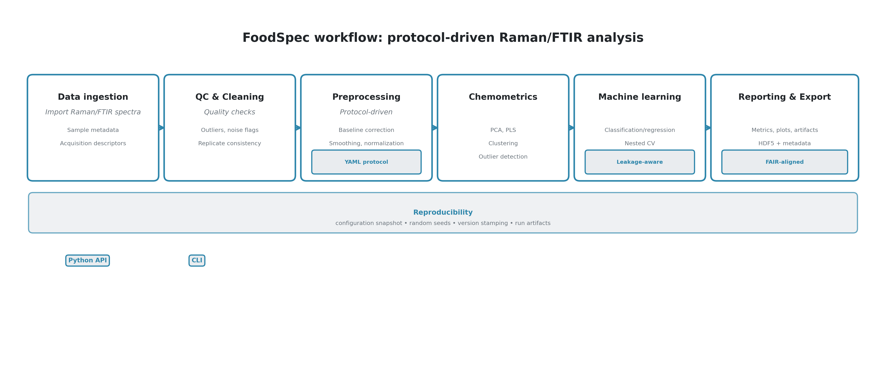

## Summary

FoodSpec is an open-source Python toolkit for end-to-end vibrational spectroscopy analysis in food science. It integrates ingestion of Raman and FTIR spectra, metadata handling, preprocessing, chemometrics, machine-learning pipelines, validation, and reporting into a single reproducible workflow. The package targets food scientists, spectroscopy researchers, quality-control laboratories, and graduate students who require standardized analysis rather than ad hoc scripts. FoodSpec provides domain-specific workflows for oil authentication, heating quality monitoring, and mixture analysis, and supports reproducible protocol execution using YAML specifications. Data are stored in FAIR-aligned, metadata-preserving formats to facilitate reuse, provenance tracking, and auditability [@wilkinson2016]. The software is distributed under an open-source license and designed for scriptable, CLI-friendly use in both research and routine analytical settings.
FoodSpec is openly available on GitHub (https://github.com/chandrasekarnarayana/foodspec), distributed under the MIT license, documented at https://chandrasekarnarayana.github.io/foodspec, and installable via `pip install foodspec`.

## Statement of need

Vibrational spectroscopy is widely used in food science for authentication and quality monitoring [@danezis2016], yet analytical pipelines remain fragmented. In practice, researchers often combine vendor GUIs with spreadsheets and custom scripts, resulting in inconsistent preprocessing, validation, and reporting. Such fragmentation limits reproducibility, obstructs cross-laboratory comparison, and makes it difficult to transfer models to new batches or instruments. The risk is not only technical debt but also biased performance estimates when preprocessing is applied before splitting or when replicate samples leak across folds [@leite2013; @varoquaux2017]. These issues are well documented in applied spectroscopy and machine-learning studies and can produce misleading conclusions if not mitigated [@danezis2016].

Food-specific challenges further motivate a dedicated toolkit. Food matrices vary in composition and processing history, requiring domain-aware preprocessing and feature engineering. For example, oil authentication often relies on interpretable, lipid-band descriptors and band-ratio features around key Raman modes [@cepeda2019]. Heating degradation studies require time-resolved trend analysis and robust preprocessing to distinguish chemical changes from acquisition variability [@galtier2007]. In addition, hyperspectral and spatially resolved measurements introduce structured variance that benefits from spatial-spectral workflows [@gowen2007]. While the Python ecosystem provides powerful general tools, the absence of standardized, food-focused workflows and reproducibility safeguards has led to a proliferation of bespoke pipelines with heterogeneous reporting practices.

FoodSpec addresses these needs by providing protocol-driven pipelines that standardize data ingestion, preprocessing, feature extraction, modeling, and reporting. It includes validated baseline correction and normalization methods aligned with established practice [@eilers2005], leakage-aware validation strategies, and structured run artifacts that capture configuration, versions, and random seeds. Together, these features enable transparent, repeatable analyses, support FAIR-aligned data stewardship [@wilkinson2016], and reduce barriers to reproducible food spectroscopy research.

## State of the field

The Python scientific ecosystem provides foundational libraries for spectroscopy analysis, including numerical computation with NumPy [@numpy] and SciPy [@scipy], and machine-learning workflows with scikit-learn [@scikit-learn]. These libraries are widely adopted and form the backbone of many bespoke pipelines, but they do not provide domain-specific spectral preprocessing, validation safeguards, or food-focused workflow templates. Researchers therefore rely on a patchwork of scripts, which introduces variability in preprocessing decisions and performance reporting.

Several open-source spectroscopy packages address parts of the analysis workflow. SpectroChemPy offers spectroscopic data handling and analysis utilities [@spectrochempy]. RamanSPy provides Raman-specific preprocessing and analysis tools [@ramanspy]. Specutils supports spectral analysis in astronomy and related contexts [@specutils], and HyperSpy provides advanced multidimensional spectral analysis [@hyperspy]. These tools are mature and valuable, but they typically prioritize general-purpose spectroscopy or domain-specific preprocessing rather than end-to-end workflows that emphasize robust validation and standardized reporting. Moreover, food-specific workflow templates and FAIR-oriented export are not the primary focus of these packages.

Commercial platforms provide GUI-based workflows but are typically closed-source and less suited to transparent, automated, versioned pipelines. Consequently, there is a gap between flexible open-source building blocks and reproducible, standardized pipelines tailored to food spectroscopy. FoodSpec is positioned to bridge this gap by combining protocol-driven workflows, domain-specific templates, and FAIR-aligned data export with the extensibility and interoperability of the Python ecosystem.

## Software Design

FoodSpec is organized around a small set of core data structures and modular pipeline stages. The primary container, `FoodSpectrumSet`, represents one-dimensional Raman or FTIR spectra together with sample-level metadata, acquisition descriptors, and provenance. For spatially resolved measurements, `HyperSpectralCube` supports spatial-spectral data and enables workflow components that operate on both the spectral and spatial axes. A `MultiModalDataset` abstraction provides a consistent interface for combined measurements across instruments or modalities. These data objects support slicing, preprocessing, and export, and use HDF5-backed storage for efficient handling of large datasets with preserved metadata [@hdf5].

The analytical workflow is modular: (1) import and validation, (2) quality checks and cleaning, (3) preprocessing, (4) feature extraction and chemometrics, (5) classification or regression, and (6) reporting and export. Preprocessing includes baseline correction, smoothing, normalization, trimming, and artifact removal (e.g., spike correction), aligned with standard spectroscopic practice [@eilers2005]. Chemometrics modules provide PCA, PLS, clustering, and outlier detection [@wold1987; @martens1989], while machine-learning workflows wrap scikit-learn-compatible estimators with consistent input/output interfaces [@scikit-learn]. Validation utilities provide leakage-aware splitting and support nested cross-validation, calibration diagnostics, and interpretable reporting of performance uncertainty [@varoquaux2017].

Protocol-driven execution is central to reproducibility. YAML specifications define preprocessing steps, model choices, and validation settings and are stored alongside run artifacts to enable exact reruns. FoodSpec records configuration snapshots, random seeds, and software versions to reduce analytical drift across environments. Both Python and CLI interfaces are provided so workflows can be executed interactively or as batch pipelines with identical protocol definitions. Automated tests run in continuous integration to support reliability and stable releases. Documentation and examples are maintained alongside the codebase to promote transparent use, reproducible practice, and adoption.

A representative end-to-end workflow is illustrated in \autoref{fig:foods}, where raw spectra are imported with metadata, processed via a protocol-defined preprocessing pipeline, modeled using chemometric and machine-learning stages, and evaluated with standardized validation.

## Research Impact Statement

FoodSpec enables reproducible method development for food spectroscopy applications such as oil authentication and heating quality monitoring, providing standardized pipelines aligned with common analytical practices [@cepeda2019; @galtier2007]. By enforcing protocol-driven preprocessing and leakage-aware validation, the toolkit reduces the risk of over-optimistic performance estimates and facilitates meaningful comparison across datasets, instruments, and laboratories. FAIR-aligned storage and metadata preservation support long-term data reuse, provenance tracking, and auditability [@wilkinson2016; @hdf5].

Leakage-aware validation and grouped splits promote defensible performance estimates and reduce optimistic bias in applied studies [@leite2013; @varoquaux2017]. HDF5-backed exports combined with preserved metadata support cross-study reuse and transparent data stewardship in line with FAIR principles [@hdf5; @wilkinson2016].

The software lowers barriers for training and adoption by providing reusable workflows, examples, and a unified API. For research groups, this reduces the time from raw spectra to reproducible results and supports transparent reporting. For quality-control laboratories, FoodSpec provides traceable outputs and standardized metrics that improve confidence in routine screening and compliance-related documentation. These impacts align with calls for reproducible and transparent practices in applied spectroscopy and chemometrics [@leite2013; @varoquaux2017].

## AI usage disclosure

The authors used AI-assisted tools to improve clarity and organization of the manuscript. All technical claims, interpretations, and references were reviewed and verified by the authors.

## References
